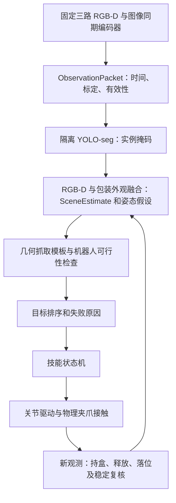

# 项目路线与当前状态交接

更新：2026-10-09。供新对话与接手开发者阅读。启动命令、代码目录和现有 API 只在 [README.md](README.md) 维护；协作硬约束见 [AGENTS.md](AGENTS.md)。本文件合并此前的路线、技能说明、三相机说明与实测摘要。

## 1 当前交接节点：2026-10-09

**当前交接范围：基础视觉抓放已有受控物理案例，通用盒体几何估计已通过逻辑与保存帧回放，全姿态执行接口已通过逻辑检查，尚未完成转动物理验收。** 最新完整抓放开发回归 62 通过，侧放/倒置静态识别 63/64 各一例通过，精确范围见第 15、16 节；新增估计见第 17 节，本次发布检查与姿态接口增量见第 18 节。不代表随机初态、多盒或调整/翻面成功。原三相机保持，凸包边界检查已彻底删除。下列清单是当前待办；后文保留历史过程，其中旧的“下一步”“尚未实现”描述以本清单和较新证据为准。

项目主线已确定：固定三机位 RGB-D 与机器人状态 → 带不确定度的视觉场景估计 → 规则任务编排 → 抓姿与完整路径规划 → 单臂/双臂技能执行 → 传感器复核 → 重观察或恢复。最终感知、决策和技能代码在仿真与真机共用，替换传感器与机器人驱动适配器。训练可以借助仿真真值，导出后的动作策略与在线监测只能使用现实可得输入。

用户已授权增量开发、逻辑检查和必要物理实测。2026-10-09 最新要求是将当前成果提交并推送远端，文档仅更新现有对应文件。此前“停止重复研究已实现部分”的要求继续适用；本次针对累计待提交代码进行逻辑与配置检查，没有重新开展资源盘点或模型选型。后续按实际缺口继续，继续使用几何抓取模板，只有实测发现具体瓶颈时再评估新的模型或依赖。

### 1.1 已完成部分：复用，不重新开发

- 固定三相机、`ObservationPacket`、`PolicyObservationAdapter`、图像同期机器人状态与腕相机 FK。
- 隔离模型环境及项目微调 YOLO-seg 接入、RGB-D/外观融合、`SceneEstimate V1`、目标关联与轮廓/可见边显示。
- 几何候选、解释性排序、Lula IK、球体碰撞、观测障碍检查与有限采样路径/RRT。它们已有实现，通用安全能力仍受下述验收边界限制。
- 受控直立单盒视觉抓放及侧放/倒置静态识别的上述实测；凸包边界查询及其专用测试已删除。

### 1.2 唯一当前待办清单

| 顺序 | 剩余工作 | 当前真实状态 | 完成条件与复用位置 |
|---|---|---|---|
| 1 | 转动中的视觉持盒位姿与滑移判断 | `cuboid_pose.py` 与 `CuboidHoldingTracker` 已实现，身份关联/规划确认端口已支持；20 项专项逻辑和 9 份真实保存帧回放通过。现有抓放技能仍使用原直立 observer，未验收实际转动持盒 | 新调整技能接入通用 tracker，验证转动过程、实际滑移、遮挡与观测丢失。FK 只作关联提示，输出位姿来自当前 RGB-D，保留对称/未知假设 |
| 2 | 任意 TCP 姿态执行验收及调整抓取模板 | `execute_cartesian` 已接通可选全姿态请求、原有 IK/插值/预检、逐段最新观测复查和终点姿态检查；15 项新增逻辑通过。尚无转动物理验收，当前直接抓取模板未覆盖侧放/翻面 | 复用 `simulation/robot_driver.py`，新技能接通通用 tracker 与及时的新帧监测，实测接近/转动/撤离及持盒扫掠；开发有限调整抓取模板，不重建控制器 |
| 3 | 视觉 SideAdjustment | 尚未实现物理闭环 | 接收视觉目标，物理抓取并调整、释放后重新识别；顶面方向不明时保留假设，不能强行认定已正放 |
| 4 | 视觉 DualArmFlip | 仅有读取真值的历史交接基线，尚未迁移成视觉技能 | 复用 `baselines/dual_handover.py` 的动作经验，在 `skills/` 实现视觉输入和交接证据：发送端释放撤离、接收端独立持盒、最终正放稳定 |
| 5 | 技能分发及失败恢复闭环 | 排序/选择已有；实际主要接通 DirectPickPlace 和被动 Reobserve，侧放/倒置仍因技能缺失退出；持盒失败恢复仅有建议 | 在 `planning/selection.py` 与 `skills/` 接通新技能、重规划、有限重试和安全退出。重观察只取现有三路新帧，不执行专门补看运动 |
| 6 | 少量分离纸盒连续整理 | `skills/visual_sorting.py` 已有 1–3 盒循环、目标 ID/槽位管理和次数限制，尚无完整多盒物理验收 | 先验证两盒，再三盒：实际排序、邻盒干扰、槽位占用、连续执行及每次动作后复核；复用现有循环 |
| 7 | 遮挡/乱序场景逐步扩展到九盒 | 旧分割评估仍有漏检/误检；九盒释放沉降历史不能证明视觉整理 | 依据具体漏检、合并和几何失败补项目数据及算法，逐步验收遮挡少量盒再九盒；不重新部署重复检测模型 |
| 8 | 新能力的独立验收与路径安全边界 | 最新抓放是开发回归；转动、调整、交接、恢复、多盒及通用避碰尚无充分证据 | 每项新能力事先冻结条件/次数，报告全部成败和原因；补不同初态及相关路径验证。全臂未知空间、空臂撤回、连续/通用避碰仍未证明安全，不能恢复已删除的凸包边界检查或沿用旧范围成功率 |

**恢复开发时：复用第 2 项已接通的姿态执行接口，先接入第 1 项通用 tracker 与实时新帧监测，完成受控转动物理验收，再推进 3 → 4 → 5 → 6 → 7；第 8 项随对应新能力验收。** 不重复静态 SIDE/INV 识别来代替转动或技能验收，不重写现有 IK、夹爪驱动、采集系统或多盒循环。

GraspGen、FoundationPose、ROS 迁移及真机适配不作为当前必做前置任务。GraspGen 已按用户选择暂缓；真机传感器、手眼/TCP 标定与驱动替换属于后续部署工作。历史 JSON 保持原样，各次检查与实测分别报告。

### 1.3 接手时先确认的运行条件

- 仓库 `D:\xietong\Bimanual-manipulation`，原生 Isaac Sim 6.1 安装于 `D:\Issaccc`；此前读取到 SDK 为 `6.1.0-rc.26`，不是 Isaac Lab 项目。
- 入口只用根 `launch.ps1` 或 `python -m workstation`。仿真必须经 `D:\Issaccc\python.bat`；模型由仓库 `.venv-models` 独立运行。
- 当前视觉抓放使用项目微调 YOLO11n-seg 运动视角权重 `outputs/carton_seg_motion_training_20261007/fit/weights/best.pt`，阈值 `.4`。不要把默认几何分割或 YOLOE 零样本结果当作该权重的验收结果。
- 2026-10-09 用户授权将本轮源码、测试、配置、现有三份文档及精选证据提交并同步 `origin/main`，替代较早节点“不提交、不推送”的安排。提交与同步状态以 `git log -1 / git status -sb` 为准；不改写远端历史、不清理本地数据。
- 较早节点的源码快照和检查日志保存在 `outputs/visual_reorientation_20261009/`，精选记录为 `evidence/visual_checkpoint_20261009.json`。其中 `committed/pushed=false` 仅描述该历史节点，保持原始字段；快照是本地备份。本次发布检查日志在 `outputs/publish_20261009/`。
- 权重、依赖环境、完整图像/视频/运行报告均由 Git 忽略并保留本地，新克隆需要按 README 另行准备。上传源码不等于上传 SDK、模型或完整运行数据。
- 只查看当前状态时阅读本节；理解总体设计阅读第 5、6 节；需要复核数值时阅读第 15–18 节。第 8–14 节是历史开发过程，不再照着旧“下一步”重复实施。

## 2 当前成果与证据边界

下表保留截至 2026-10-06 的交接基线，2026-10-07 的新增模块、资源审查与独立验收见第 8 节。

| 能力 | 已有状态 | 未覆盖范围 |
|---|---|---|
| 固定双 Panda、桌面、卸料盘、逻辑三格与物理输送带 | Isaac Sim 6.1 中已实现；九盒 seed 6 释放与沉降有历史实测 | 未证明所有初态、全工作空间或长期运行 |
| 正式三相机采集 | RGB-D、K、诊断实例标签/动态外参、物理腕层级随动已有实测 | 实机拍摄/标定、真实噪声/延迟、全空间可见性 |
| `ObservationPacket / SimSensorAdapter` | 一次最小 Isaac 接口检查通过；三姿态、FK 对照与逐路异常隔离 | 逐 annotator 来源帧、真实采集延迟、真实适配、视觉消费者 |
| `PolicyObservationAdapter` | 本轮真实三姿态采集通过；双臂 qpos/qvel/TCP、16 维 state、三路 CHW/mask、ACT stack、LeRobot 字段与同步检查 | action 合同、归一化、模型/数据集接入、训练与策略执行 |
| 直立单盒物理抓放 | 固定左臂案例成功，最终三相机配置下完整回归成功 | 视觉驱动、通用抓姿、随机成功率 |
| 倒置单盒物理交接与翻正归位 | 固定位置/倒置姿态、无邻盒障碍的案例成功 | 正式三路下完整交接可见性、新三路录像、视觉持盒判定与泛化 |
| 三盒物理输送 | 预先放好的三盒出站有历史验证 | 自动整理与输送联合闭环、尾批处理 |
| 侧放扶正、通用避碰、失败恢复、多盒整理 | 未实现 | 依赖后续感知、规划与任务层 |
| 学习策略、真机传感器/驱动适配与实机运行 | 未实现 | 现场设备接口、标定和部署 |

### 保留的历史记录

目录整合时保留五份小型历史 JSON 和唯一成功录像 `evidence/dual_handover.mp4`，其他旧重复生成物已清理。录像仅本地保留、Git 忽略，新克隆不含；它来自旧 `overhead / oblique` 视角，不能代表新版正式三路录像或部署输入。旧 JSON 原始字段保持不变，其中 `recording.file=handover.mp4` 对应该归档录像。本轮另追加一份独立策略接口实测 JSON，失败与成功运行输出均保留。

| 仓库记录 | 支持的历史结论 |
|---|---|
| [evidence/single_pick_place.json](evidence/single_pick_place.json) | 最终三相机下固定直立单盒成功：抬升约 0.179967 m、最终 XY 误差 2.733 mm、胶带轴 yaw 误差 0.00913°、松爪撤臂后稳定 0.5 s、两臂回 home |
| [evidence/dual_handover.json](evidence/dual_handover.json) | 固定倒置单盒成功且交接验证通过：发送臂松开撤离，接收臂独立抬升约 0.04035 m；最终 XY 误差 0.522 mm、轴向 yaw 误差约 0.178°、稳定 0.5 s |
| [evidence/policy_input.json](evidence/policy_input.json) | home、左臂小幅运动、双臂小幅运动均输出三路 640×480 RGB-D；FK 外参最大位置差 0.007305 mm、旋转差 0.0008091°；`STALE / MISSING / INVALID` 隔离通过 |
| [evidence/three_camera.json](evidence/three_camera.json) | 当时全部 42 组相机文件的尺寸、有限深度、实例类型、标定关系、腕独立运动和低频采集检查结果；原数组与图像已清理 |
| [evidence/camera_performance.json](evidence/camera_performance.json) | 最终历史完整运行的渲染/读取/保存耗时和 GPU 整体显存采样；不是新版性能基准或进程专用显存 |

旧单盒与双臂控制使用 Lula IK、关节位置驱动和物理指爪接触，未使用物体绑定或运行中改写盒体位姿。两次同配置交接成功不能推出随机成功率。`ccb9ac3` 的目录整合当时仅做静态检查；本轮已重新运行整合后的 `sensor-check`。本轮没有重新执行完整单盒抓放、双臂交接或三路录像，不能把接口采集成功扩展为接触动作回归通过。

### 2026-10-06：策略 Observation V1 验收

精选原报告为 [evidence/policy_observation_v1.json](evidence/policy_observation_v1.json)，原始成功目录 `outputs/policy_obs_v1_20261006_212304_875/`，其中 `run_status.json` 为 `passed`、进程退出码 0。

| 级别 | 本轮命令与结果 | 支持的结论 |
|---|---|---|
| A：静态/单元 | `D:\Issaccc\python.bat -m unittest discover -s tests -q`，52 项通过；五模式配置、Python 编译、PowerShell 解析、`git diff --check` 通过 | 名称乱序提取、schema/类型/图像转换、占位 mask、时间容差与旧接口逻辑正确 |
| B：Isaac 初始化 | 根 `launch.ps1 -Mode sensor-check -Headless -IsaacRoot D:\Issaccc` 中真实初始化完成 | 两 Panda articulation、三路 Replicator、Lula FK 与 qpos/qvel API 可用 |
| C：物理运行采集 | 同次运行推进物理、驱动左/右关节小幅运动，home/left_moved/both_moved 三姿态采集通过 | 三路 640×480 RGB-D、完整机器人状态、16 维 float32 state、`(3,3,480,640)` stack、mask 全 True、sync_ok True |

实际两臂 DOF 顺序均为 `panda_joint1…7 / panda_finger_joint1 / panda_finger_joint2`；新接口按名称解析，乱序情况由单元测试覆盖。左右原生 finger 下标本次为 7/8，不作为永久假设。三姿态相机—机器人时间偏差为 0；这是仿真统一物理时钟下的配对，不是硬件同步或 annotator 同曝光证明。

真实运行内的异常注入覆盖：暂停渲染 19 个物理步产生 STALE；暂时移除右路产生 MISSING；左路 RGB annotator 注入异常产生 INVALID。对应策略 mask 为 False、占位全零，其他有效视图保留。另对实测包注入 0.03 s robot timestamp 偏差，超过 0.02 s 容差后 sync_ok=False。低频模式 48 步恰好 4 次渲染、2 次持续采集，无新增 PNG/NPY。

首轮 `outputs/policy_obs_v1_20261006_211623_532/` 已取得三组有效输入，但旧诊断固定等待 60 步后在右腕独立运动判据失败，整体记录为失败。本轮诊断改为按实测速度等待稳定：至少 0.5 s、两臂 arm 速度不超过 0.02 rad/s 并保持 0.1 s，最多 3 s；原独立运动阈值没有放宽。复测左右运动各等待 99 步/0.825 s，通过。右臂运动期间另一腕最大矩阵元素变化约 0.002282，scene 为 0；矩阵差不是统一的米制距离。

本轮没有改变两份基线控制器或三相机安装配置。C 只证明接口运行采集，不证明抓放、翻面、视觉判断或策略模型的成功率。

### `ccb9ac3` 的目录整理

启动入口已收敛为根 `launch.ps1` 和 `python -m workstation`。仿真、观测、真值基线与传感器诊断按模块划分，参数移到唯一 `config/scene.json`，逻辑检查移到 `tests/`。两份 CMD 快捷入口和第二套相机验证 CLI 删除；旧验证中的腕独立运动和 48 步低频无图保存逻辑纳入新 `sensor-check`，完整抓放通过 `single-pnp` 独立运行。

额外 `overhead / oblique` 相机配置与旧视频采样分支删除，双臂基线录像改为正式三路 RGB 拼接；默认不保存 PNG/NPY，通过 `--save-images` 显式开启。它们不改变当前真值基线的身份，也不构成视觉闭环。

## 3 场景语义与三机位安排

当前世界为米制 Z-up。台面高 0.76 m，两个 Panda 基座位于 `[-0.36,0.25,0.82] / [0.36,0.25,0.82] m`，均绕世界 Z 为 -90°。每臂 7 关节加 2 指关节，物理步长为 1/120 s。纸盒为 `100×55×45 mm / 80 g` 刚体，局部 +Z 是胶带所在的指定顶面，+X 是长轴；未建模纸板形变与真实材料辨识。

胶带无箭头，当前朝向按 180° 对称轴评价，0°/180° 等价。若要求唯一前向，需要可观察的非对称外观证据及有向 yaw 判据。是否允许方向标记仍待现场/任务要求确认，不能用仿真 ID 或固定初始朝向补足歧义。

三格是软件标定目标，没有可渲染几何、碰撞体或图像标签。目标坐标属于工位参数，可在真机标定得到。当前输送逻辑要求三格连续稳定合格、无额外阻挡且机器人联锁允许才输送；单盒完成后继续等待其余两格。三盒出站由接触摩擦产生位移，未改写盒位姿。尾批不足三盒的结束触发尚未设计。

正式机位数量与安装角色已经由用户确认，其他视角现实不可获取：

| 相机 | 当前仿真安装 | 闭环中的职责与限制 |
|---|---|---|
| `scene_camera` | 位置 `[0,-0.41,1.76] m`，look-at `[0,-0.11,0.80] m`，36 mm 焦距 | 全局选盒、遮挡/障碍关系和撤臂后落位复核；单盒下放时活动手掌会挡住目标大部分 |
| `left_wrist_camera` | 物理 `panda_hand` 下 mount 平移 `[-0.065,0,0.025] m`，20 mm 焦距 | 左臂接近、夹持、下放近景；历史下放同帧可见盒与夹指，仍有自遮挡 |
| `right_wrist_camera` | 物理 `panda_hand` 下 mount 平移 `[0.065,0,0.025] m`，20 mm 焦距 | 右臂接收/抓取近景或空闲时补观察；不是所有左侧动作的通用备份 |

三路均为 640×480，腕部外参完整四元数在配置中，不在文档再复制数值。腕挂载依靠 USD 物理手掌层级随动，无 Python 每帧写世界位姿；更换资产时须区分同名外观网格与带 `RigidBodyAPI` 的手掌 link。没有隐藏机器人几何来消除遮挡，相机外壳质量与碰撞模型尚未加入。

重新观察仅可取这三路新帧，或规划安全路径移动现有腕相机。移动腕部后应更新外参与场景版本；看不到胶带只能给出未知，不能直接判为底面或倒置。三路均不足以确认夹持/交接时，保持安全夹持、停止或恢复。

## 4 现有输入接口做到哪里

`env.observe_policy_inputs()` 和兼容别名 `get_observation_packet()` 返回同一个 `ObservationPacket`。既有 RGB-D、有效深度掩码、K、FK 外参、采样时间、序号及逐路异常隔离均复用；现已补入同期两臂 arm/finger qpos/qvel、夹爪宽度和名义 Lula TCP。原始包另保留组包时最新状态。完整字段和使用方法只在 README 维护。

`PolicyObservationAdapter` 将原有三路采集名称映射为 `cam_high / cam_left_wrist / cam_right_wrist`，不改变安装和记录器。输出三路独立 CHW float32、异常 mask 和按 schema 排列的 16 维 state；qvel/TCP 在 raw 包中保留，V1 不送入模型。ACT stack 与 LeRobot 字段转换是轻量格式 helper，不是已训练策略、数据集写入器或动作接口。

按 articulation 的实际名称提取 DOF，再按 Lula 的名称排列计算 FK。相机渲染前锁存两臂实测 qpos/qvel，策略 state 使用这份图像同期状态；组包最新状态不能替换它。同步容差默认 0.02 s、帧龄 0.15 s，配置集中于 `policy_observation`。缺视图、过期或时间偏差超限显式返回无效 mask/同步结果。原始 `OK / MISSING / STALE / INVALID` 保留，黑图只存在于格式转换层。当前仍无力觉、电流、精确接触反馈或场景版本。

初始目标识别可主要用 RGB/深度；执行阶段还需要关节和夹爪状态。腕图转换到工位系始终需要图像同期的关节与手眼标定：`T_workcell_from_camera(t) = T_workcell_from_hand(q(t)) × T_hand_from_camera`。初始识别不需要把关节角喂给外观网络，但几何定位依然需要该变换。当前 scene 外参来自名义配置，两腕由测得关节的 Lula `panda_hand` FK 和配置 mount 得到，真机须替换为实测标定。

策略路径在采集阶段不读取实例分割或渲染器相机变换；默认 `observe_cameras()` 仍保留这类诊断字段。实例标签表示渲染器知道哪块像素来自哪个物体；动态外参表示渲染器直接知道相机真实世界位姿。它们能做离线标签和核查，不能当作实际相机能直接输出的策略数据。

接口的剩余限制：

- 当前只锁存渲染物理时刻的关节，并提供统一渲染序号；各 annotator 的来源帧 ID 缺失，不能独立证明 RGB、深度和 K 严格同曝光。
- `STALE` 按仿真物理时钟计算；渲染/传输/推理的真实耗时不推进该时钟。`refresh=True` 可反复渲染却不推进物理，不能把序号增长当新物理观测。
- 仿真采用理想针孔与理想深度。真实适配需 RGB/深度配准、内外参、左右手眼/TCP/基座与目标槽标定、硬件时钟同步、实际延迟与缺测/噪声建模。
- 指位置可以计算夹爪开度，不能单独证明抓住盒子。现场是否提供抓取状态、力/电流或接触反馈尚需确认。
- 独立 `PrivilegedRecord` 和未来消费者的访问隔离仍未完成；目前基线持有环境引用，因此仍能读真值。不能因为输入包过滤完成就声称整个控制链隔离完成。

历史三路渲染每 4 个物理步一次，但完整回归 render+app.update 平均约 188 ms 墙钟耗时。30 Hz 是仿真步对应频率，未达到的实时视觉频率不能据此宣称。先在关键阶段采新图，底层跟踪和保护使用较高频机器人反馈；后续训练按实际帧间隔、延迟和缺帧设计输入历史。

## 5 总体思路、职责与闭环组合

### 为什么采用当前组合

任务最终需要决定“抓哪一个、怎样抓、是否先调整、动作是否真的成功”。分割模型解决图像中的实例范围；RGB-D 几何解决米制位置、轴向和可见面的约束；机器人模型解决可达性与路径限制；规则排序和状态机把这些证据变成可解释的动作与恢复分支。模型分数无法代替接触空间、路径检查和动作后验证，因此当前方案把学习用于实例分割，把可计算的约束留在几何、规划与执行层。

已经尝试 YOLOE 文本/参考图提示，项目图像中效果不足，随后使用项目数据微调 YOLO11n-seg。正式推理直接复用它一次输出的实例框和掩码，没有叠加第二个同功能检测器。已知盒型尺寸优先使用有限几何抓取模板；GraspGen 缺本机可运行服务及 TCP 标定，且用户选择暂缓。FoundationPose 或小外观分类器仅在当前几何/包装证据出现具体瓶颈时再引入，不是本阶段必须重选的方案。

### 一次在线决策如何形成



这是最终闭环结构，图中不表示所有技能均已完成；实际状态以第 1.2 节为准。各层当前职责如下：

1. **观测层先保证数据能解释。** 正式相机名不变，RGB/米制光轴深度/有效掩码/K 必须对应同一图像。腕外参使用图像时刻关节 FK 与安装标定；最新机器人状态只用于执行当前动作，不用于重新解释旧图像。缺帧、过期、不同步或黑图必须显式无效。
2. **感知层给出观测事实与未知。** 分割掩码只表示可见像素；绿色轮廓是实例边界，青色线是深度支持的可见面交界，不补画隐藏的十二条边。`SceneEstimate` 的 ID 来自感知跟踪。静态估计融合尺寸、几何与胶带/折边证据；看不到胶带不等于倒置，侧放仍可保留两种顶面方向假设。
3. **运动中重新测量盒体。** 原直立 tracker 已有有限物理证据，其局部表面支持不能称为通用 6D 测量。新增通用 tracker 用当前 RGB-D 的法向、平面和可见尺寸约束测量盒体位置/旋转；初始视觉假设与图像同期 FK 只提示对应关系。测量缺轴、位姿冲突或表面支持不足时返回未知，不复制 FK 推算的盒体位姿。对称方向不因几何拟合成功而自动消失。
4. **规划层先判断动作能否执行。** 检查夹爪开度与空间、邻盒、关节限位、机器人自身/另一只臂、固定工位及持盒扫掠。当前为球体/包围盒及采样路径近似，有有限 RRT；Lula IK 成功不等于整条路径安全。未观察空间保留未知，凸包边界查询不恢复。
5. **排序与技能层分别回答两个问题。** 排序比较估计质量、空间、可达性、路径余量、动作代价与失败记录；技能选择决定直接抓放、调整、翻面、重新取帧或退出。侧放/倒置不天然等于不能抓，直立也不天然等于可抓；当前直接模板仅支持直立是实现范围，不能当作物理定律。缺抓姿、遮挡、不可达、路径阻塞和语义未知分别记录原因。
6. **物理执行必须用观测确认。** 夹爪闭合命令和开度只说明机器人动作，不单独证明抓住。抬升要有视觉离台/持盒支持；交接要证明发送端释放撤离后接收端独立持盒；放置要在松爪撤臂后的新帧中确认格位、姿态和稳定。每次动作改变场景后重新估计，不沿用旧抓姿一直执行。

三路相机的安装、朝向和焦距保持用户配置；重新观察目前取新帧，不自动执行专门补看的腕部运动。正常技能运动导致腕相机随臂运动时继续按同期 FK 解释。

### 数据合同：现有实现与拟议接口

下面前四项已有实现或对应数据输出；`SkillRequest / MotionPlan / SkillResult / PrivilegedRecord` 是后续统一合同设计，不能据此认定已经全部实现成正式类型。当前技能仍主要通过机器人端口、阶段状态和报告字典交互。

下面 `ObservationPacket / PolicyObservationAdapter` 已实现；其余是未来接口约定，不是已有可调用功能。

| 接口 | 关键内容 | 生产者 → 消费者 |
|---|---|---|
| `ObservationPacket` | 三路 RGB-D/有效掩码/K/FK 外参、时间、机器人状态、逐路可用性 | 仿真/未来真实适配 → 感知与执行监测 |
| `PolicyObservationAdapter` | 三路独立 RGB/mask、16 维双 Panda state、同步结果、可选独立 depth、ACT/LeRobot 格式 | 观测包 → 未来模型消费者；无动作执行 |
| `SceneEstimate` | 感知自身实例 ID、盒体中心/姿态假设、尺寸来源、可见掩码/面交界边、规则质量指标、失败原因、时间与版本；未知显式表达，规则分数不作为概率 | 感知 → 任务层和候选规划 |
| `GraspCandidate` | 对象与执行臂、TCP 抓姿、开度、接近/撤离方向、持盒碰撞体、代价和路径可行性 | 抓姿规划 → 任务层/技能 |
| `SkillRequest` | 技能、对象、目标槽、双臂角色、候选、前提、资源锁、超时与场景版本 | 任务层 → 技能执行器 |
| `MotionPlan` | 两臂关节轨迹、夹爪命令、持盒碰撞体、速度/力边界、允许接触阶段和取消条件 | 完整路径规划 → 仿真/真实驱动 |
| `SkillResult` | `SUCCEEDED / FAILED / UNKNOWN / ABORTED`、结束阶段、失败码、传感器证据、重观察与资源释放要求 | 技能/监测 → 任务层 |
| `PrivilegedRecord` | 仿真位姿、实例标签、速度、接触、奖励与成功标签，独立于运行路径 | 标签/训练教师/critic/离线诊断 |

后续任务层先顺序执行，进一步完善执行臂、槽位与共同交接区的资源预留。技能按 `check_preconditions → propose_grasps → plan → execute → verify` 组织；场景改变、失败、观测过期后重新规划。短时持盒预测只能供有界路径模型使用，不能冒充新的视觉测量或动作成功证据。未来接输送时，启带/出站与尾批结束也需要可部署的观测联锁，现有真值输送演示不自动获得视觉验收。

## 6 规则与训练如何分工

没有一种基础动作因动作名称而必须训练。“规则”包括基于估计状态的几何求解、候选搜索、约束规划、状态机和反馈控制；固定关节轨迹播放不能代表通用规则技能。

| 部分 | 第一版实现 | 何时考虑学习 |
|---|---|---|
| 盒体识别、顶面与姿态估计 | 当前已用微调 YOLO-seg 实例分割，几何与包装线索负责状态融合 | 严重遮挡、包装/盒型变化或正倒证据不足时，针对已测瓶颈微调分割或外观模型 |
| 直立抓放、倒置交接翻面 | 参数化现有动作阶段，加入估计状态、规划与传感器监测 | 候选排序或局部接触修正出现明确瓶颈 |
| 侧放扶正、拨动/分离、重抓 | 先低速规则动作与重观察，设置可恢复失败 | 摩擦、尺寸和形变导致规则接触长期不稳 |
| 高层选盒/选臂/选技能 | 可行性、优先级、资源锁与失败重规划 | 多盒选择成为明确性能瓶颈 |
| IK、避碰、安全约束、停止与联锁 | 确定性计算和明确限制 | 维持约束，不交给无约束网络替代 |

训练先解决视觉。训练输入仅含正式三路 RGB-D、可标定参数和关节 FK，真值掩码/位姿/顶面单独存为监督标签。教师可以用真值生成示范，奖励和只在训练时存在的 critic 可以用真值；任何最终会输出动作或决定继续/停止的 actor 输入只能来自观测包或其估计状态。感知实例 ID 也不能等同仿真 ID。

若规则技能已能完成但接触适应不足，再取一个短阶段训练：脚本示范 → 行为克隆初始化 → 有界残差策略。输入为估计相对位姿、置信度、技能阶段、关节/夹爪及现场实际反馈的短时历史；输出限幅 TCP 或夹爪/顺应设定修正，经过运动与安全层过滤。零修正沿用规则控制，不先训练整个端到端任务。不可观测时的示范应重观察或退出，不能要求学生猜隐藏真值。

训练域逐步扩大：已知尺寸单盒 → 位置/yaw变化 → 侧放/倒置 → 异尺寸和纹理 → 遮挡/多盒。覆盖实测光照、深度缺测/噪声、延迟、标定误差、质量/摩擦和驱动差异；视角只来自三个真实安装位及现有腕运动，不能随机生成第四机位。输入/动作单位、频率、控制模式和标定版本须在仿真与真机一致。

## 7 最近的实施顺序

实施顺序只维护在第 1.2 节。受控单盒 `SceneEstimate`、真值隔离通道与视觉 DirectPickPlace 已有实现和限定条件证据，不再列为从零开发项。接手从任意 TCP 姿态接口及通用持盒估计的物理验收继续，复用现有姿态 IK、四元数插值、路径检查和驱动，再接侧放、翻面、恢复和多盒。

原始方案中的完整规划、任务重试与重抓案例仅作为设计参考；ROS/MTC/FoundationPose 未成为已验证运行依赖。后续输送视觉联锁、尾批结束、实机适配和现场标定列为部署扩展项，不作为当前停止节点已完成的能力。

待现场确认的条件包括：允许的方向标记与唯一前向语义、盒型尺寸先验/范围、真实机器人和夹爪接口、实际可获得的接触反馈、目标槽/输送传感器与安全边界。三个机位的数量和角色已经确定；精确外参、手眼、TCP、两臂基座与时间同步仍需实测。

## 8 2026-10-07 只读审查、资源与视觉开发

### 起点与保留

起点为 main `ccb9ac3`，首先记录 `git status`。原工作树 11 个修改文件和 3 个未跟踪文件（策略接口、其测试及证据）均保留，未 pull、stash、回滚、清理、提交或修改历史证据。初始状态、差异与源码哈希存于 `outputs/visual_development_20261007/initial_*`。这批原接口改动仍未提交。

沿根 `launch.ps1 → __main__/app.py → SortingEnvironment → mode` 核对：旧单盒/交接在构造、阶段监测和成功判据中读取 `observe_ground_truth()`；默认 `step()` 的输送监控与 `settle()` 也用真值。新视觉 runner 使用固定 3 s 观察等待及 `step(monitor_conveyor=False)`，感知与技能不调用上述真值路径。历史 JSON 的测量条件不外推；现存未跟踪 `policy_observation_v1.json` 为上一轮成功接口记录。

### 资源核对

| 资源 | 本轮状态 | 核对结果/限制 |
|---|---|---|
| Windows/硬件 | 已可用 | Windows 11；RTX 4060 Laptop 8188 MiB、驱动 560.94；约 31.8 GiB 可见内存。显存空余约 5.6 GiB 是查询瞬时值 |
| Isaac SDK | 已可用 | `D:\Issaccc\VERSION` 为 `6.1.0-rc.26+release.49347.2d230af4.gl`，不能当成已验证所有正式 6.1 API |
| Isaac Python/几何依赖 | 已可用 | Python 3.12.13、NumPy 2.3.1、SciPy/OpenCV/Pillow 实际导入可用；普通 `D:\Scripts\python.exe` 缺 NumPy |
| Franka/Lula | 已可用 | 两臂官方 USD 在本轮真实初始化加载；本机旧兼容扩展有 URDF、robot descriptor、IK、限位和碰撞球；保留原驱动经验 |
| 三相机/标定 | 仿真可用、实机需配置 | packet 同期编码器与 FK 外参已有历史实测；本轮实际读到三路 RGB-D。当前为名义理想标定，尚无硬件配准/手眼/时钟验证 |
| 模型权重 | 未配置 | 在项目与 SDK 检索未发现已验证的盒体分割、FoundationPose 或 GraspNet 权重；不是全盘扫描结论 |
| Torch/Open3D/ROS 2 | 当前环境不可用 | Isaac Python `find_spec` 为 False；不自动装入 SDK，不把远端开源仓库视为可运行环境 |
| 测试/诊断/输出 | 已可用 | 当前逻辑测试、sensor-check、新增 vision-check；旧 JSON 保留。旧三相机全量图像已清理，不能重复离线检查原数组；新 RGB-D 输出单独保存 |
| VS Code | 已配置，UI 待刷新确认 | `.vscode/settings.json` 与 `isaac.env` 指向 SDK；独立进程已导入 NumPy 并通过测试。未直接检查 Pylance UI |

### 成熟资源评估（读取官方源码/文档与原论文）

| 方案 | 输入 → 输出、版本/许可 | 当前集成结论 |
|---|---|---|
| [Isaac 原生 Franka 示例](https://docs.isaacsim.omniverse.nvidia.com/latest/examples/manipulation_franka_pick_place.html) | pick/place 目标 + 机器人测量 → 抓放阶段/运动命令；本机 6.1 RC 的共享控制器源码带 Apache-2.0 标记，物理完成反馈与超时状态机可参考 | Windows 原生例程可用资源，但不是从图像定位的算法。本轮保留现有 Lula/物理夹爪，不采用 SurfaceGripper 附着，也不直接替换跑通基线。指定 `/6.1.0/` 文档请求失败，在线 latest 与本机源码分别记录 |
| [Isaac for Manipulation](https://github.com/NVIDIA-ISAAC-ROS/isaac_ros_manipulation)、[官方 4.3 仿真教程](https://nvidia-isaac-ros.github.io/v/release-4.3/reference_workflows/isaac_for_manipulation/tutorials/isaac_sim/tutorial_isaac_sim_pick_and_place.html) | RGB-D、标定、机器人描述、物体模型、任务 → 分割/位姿、MoveIt 轨迹与抓放；教程使用 Isaac 5.1 样例场景 | 解决完整感知规划编排，但当前 Windows/6.1 RC/双 Panda 工位不能直接套教程。需 Linux ROS 工作区、桥接、机器人配置、话题与控制器；不同 release 不混用 |
| [Isaac ROS 分割](https://github.com/NVIDIA-ISAAC-ROS/isaac_ros_image_segmentation) | RGB + DNN 权重/部分方法提示 → 语义标签或 SAM 掩码；源码 Apache-2.0，模型许可另核；main README 已出现 5.0/Lyrical，4.3 文档为 Jazzy | 语义分割不自动等于每盒实例/跟踪。后续相邻盒无法拆分或包装变化成为瓶颈时再选模型。依赖 ROS/TensorRT、输入 resize 与提示/实例关联 |
| [FoundationPose 官方实现](https://github.com/NVlabs/FoundationPose)、[CVPR 2024 原论文](https://arxiv.org/abs/2312.08344) | RGB-D、K、初始物体 mask、米制 CAD 或参考图 → 6D 位姿/跟踪；研究/评价非商业许可 | 能补复杂姿态几何，但不能代替实例分割或自然包装正倒语义。需 scorer/refiner 权重、Torch、CUDA 编译的 PyTorch3D/NVDiffRast/mycpp；官方流程偏 Linux Docker/Conda，没有本项目 Windows 3.12/6.1 可运行证据 |
| [cuMotion](https://github.com/NVIDIA-ISAAC-ROS/isaac_ros_cumotion)、[官方机器人描述说明](https://nvidia-isaac-ros.github.io/v/release-4.4/concepts/manipulation/index.html) | 机器人 URDF/XRDF、关节、目标、障碍/SDF → IK/碰撞约束轨迹、ROS action/service；仓库根为 NVIDIA Isaac ROS Software License，不能一概称 Apache | 对通用避碰有实际价值；但需双臂描述、持物几何、ROS 控制与深度自过滤。当前版本兼容未验证，先保守拒绝无可行模板的路径，不能把 IK 当避碰 |
| [MoveIt Task Constructor](https://github.com/moveit/moveit_task_constructor)、[ICRA 2019 原论文](https://noah.nrw/ubbihs/download/pdf/5137431) | PlanningScene、任务/阶段约束 → 多阶段候选与完整轨迹；master 是 ROS 1，ros2 为 MoveIt 2 main，humble 是 Humble 稳定分支；package 声明 BSD | 参考阶段串联、失败传播与解释，不直接引入 ROS/MoveIt C++ 工作区。规划的 attached collision object 是预测持物几何，不允许复制成仿真刚体绑定 |
| [GraspNet baseline](https://github.com/graspnet/graspnet-baseline)、[CVPR 2020 原论文](https://openaccess.thecvf.com/content_CVPR_2020/html/Fang_GraspNet-1Billion_A_Large-Scale_Benchmark_for_General_Object_Grasping_CVPR_2020_paper.html) | 点云 → 抓取姿态/开度/模型分数；README PyTorch 1.6、Open3D ≥0.8、自定义 pointnet2/knn；基线为非商业研究许可 | 处理复杂抓姿的候选来源，不能证明 Panda 可达/避碰或指定顶面归位。旧编译栈与本机 Python 3.12 不直接兼容；当前盒型有限模板足够优先验证 |
| [ReorientBot 官方仓库](https://github.com/wkentaro/reorientbot)、[ICRA 2022 原论文](https://arxiv.org/abs/2202.11092) | RGB-D 位姿/体积重建、已知 CAD、学习 waypoint → 重定向/重抓规划；ROS Noetic/catkin、PyBullet/吸盘案例，仓库许可限制非商业内部/学术研究 | 借鉴“位姿调整 → 再抓 → 放置”，与双 Panda 指爪工位成本高；模型、吸盘接触假设和仿真约束不能直接迁入正式物理技能。未下载/运行，不声称兼容 |

[Isaac ROS 官方 4.0 环境要求](https://nvidia-isaac-ros.github.io/v/release-4.0/getting_started/index.html)列出 Ubuntu 24.04、CUDA 13+、驱动 580+ 等条件；本机驱动 560.94 不满足该参考组合。最新 main/release 的平台要求还会变化，后续安装必须固定并再核版本。以上兼容性与代价是基于官方依赖及本机缺项的判断，没有运行上述外部完整栈。

### 本轮阶段记录

第一阶段事前定义：单盒静止低遮挡，连续 3 帧位置误差 ≤5 mm、轴向 yaw ≤5°、ID 稳定；正倒不明确须 UNKNOWN，姿态缺证据不执行。`vision_check_20261007_01` 进程退出 0，三个样本误差 0.6476–0.7232 mm、轴向 0.00540–0.00555°，ID 相同；该首版的浅色胶带被颜色门限排除，正确输出 UNKNOWN。随后通过同次保存的 RGB-D 离线复查发现并修正门限，顶部胶带可见。原报告保持不变；新入口验收追加 UPRIGHT 的外观证据要求。

逻辑验收已运行 `D:\Issaccc\python.bat -m unittest discover -s tests -q`：72 项通过（原 52 项 + 新视觉估计 12 项 + 规划 8 项）；包括缺深度/缺帧、过期、不同步、旧图同期状态、正倒未知、侧面假设、合并拒绝、跟踪、排序、邻盒空间、自/互臂碰撞与在线源码禁用属性检查。这不是图像噪声/物理成功率证据。

第二阶段事前定义：图像定位并选臂/模板，物理夹持、视觉离台 ≥0.08 m 与近 TCP 随动，松爪撤臂回 home；重新观察槽位 XY ≤0.018 m、Z ≤0.008 m、轴向 ≤8°，视觉估计速度 ≤0.015 m/s 并保持观测稳定 ≥0.5 s。

`outputs/visual_pnp_20261007_01/` 首轮失败：完成图像选臂、PREGRASP/APPROACH/CLOSE；抬升预检拒绝 `STATIC_PATH_BLOCKED:visual_0003`，未取得视觉离台证明。图像显示手掌将同盒分割为碎片，旧跟踪丢 ID 后当作邻盒，部分足迹还误匹配侧面高度。随后加入最近视觉几何的唯一碎片关联；只有多块可见表面重建成完整足迹、法向与深度一致时合并，无未观测像素/真值填充。部分足迹不输出 SIDE，并拒绝推断底面低于支撑面的尺寸假设。

新增两项遮挡测试后曾有一项失败；第二次 `visual_pnp_20261007_02` 在动作前人工停止，保留 `development_stop.json`，不计成功实测。修复后全 74 项逻辑测试通过。第三次 `visual_pnp_20261007_03` 仍在抬升预检失败：碎片的视觉关联历史过早过期，误当邻盒。关联历史改为最多 3 s，但仍只用当前可见面重建新几何，禁止输出旧位姿冒充新测量。

第四次 `visual_pnp_20261007_04` 实际进入 LIFT，随后 `HELD_CARTON_NOT_OBSERVABLE` 失败。独立事后真值显示纸箱仍在支撑面，没有成功抬起或归位；报告中的 0.028 m 来自不可靠局部几何，不可当成真实抬升。最新监测已拒绝用带失败码/部分轮廓的中心累计抬升，并区分“可靠视觉显示纸箱留在支撑面”与“可靠观测缺失”；这项监测改动仅通过纯逻辑检查，尚未重新物理验证。

新版视觉 runner 初次按原 12 次渲染预热，其后每次在冻结物理期间用现有相机系统渲染 3 次，按同期 FK 读包；不改相机系统或旧模式频率。来源帧 ID 仍缺，不能宣称严格同曝光或实时性能。

### 最新分割轮廓、可见面边与验收

用户指出旧矩形框不贴盒边，随后指出右上角暖色夹爪误分及前面交界边遗漏。图像现改为真实掩码轮廓/半透明区域；浅色像素需满足当前顶面深度和范围，暖灰夹爪侧面不因宽颜色门限纳入。该限制的第一版误排除浅色顶面，`vision_check_20261007_02` 三帧验收失败并完整保留；修正为先测顶面，再限制浅色区域后，第三次 `vision_check_20261007_03` 三帧均通过 UPRIGHT、位置 ≤5 mm、轴向 ≤5°、稳定 ID 判据。小型精选记录见 `evidence/visual_progress_20261007.json`，原始 RGB-D、标定、配置和报告在各独立输出目录。

`perception/visible_edges.py` 只在掩码内两侧都有有效深度时，用水平/垂直面的法向变化与米制直线拟合提取面交界边，写入 `SceneEstimate.edges`，青色显示；绿色显示分割轮廓。真实旧帧的独立复查图 `outputs/visual_development_20261007/visible_edge_review_left_wrist_camera.png` 去除了右上角夹爪，并识别前面交界边。该图为旧数据用新算法复查，不改写历史运行结果，也不包含缺失的同期编码器回放。几何边尚未用于修改抓取动作；不补画不可见边，不把胶带纹理作为盒边。

最新 `D:\Issaccc\python.bat -m unittest discover -s tests -q` 通过 **82 项**：原 52 项加视觉估计、候选/碰撞、轮廓、可见边与持盒证明检查。覆盖暖灰夹爪误分、浅色胶带/顶面保留、仅 RGB 纹理不产生几何边、可见前面交界的米制支持及部分几何不证明抬升。日志见 `outputs/visual_development_20261007/logic_checks_latest.log`。这些检查不能替代噪声、遮挡随机场景或物理成功率试验。

| 阶段/能力 | 历史实测证据及条件 | 本轮实际验证 | 已实现但未通过完整验收/未验证 | 尚待开发 |
|---|---|---|---|---|
| 工位、固定物理基线 | `evidence/single_pick_place.json`、`dual_handover.json`；固定纸箱初态、真值控制，不是视觉成功率 | 本轮新视觉模式正常初始化两臂、三相机、单盒；不继承旧基线成功 | 当前版本固定基线的完整物理回归 | 随机位置/姿态的成功率与边界 |
| 图像同期状态与策略包 | `evidence/policy_observation_v1.json`；上轮 sensor-check 特定诊断条件 | 本轮真实采集三路 RGB-D，并消费同期 FK 外参；原接口与测试保留 | 严格曝光 ID、真实相机时间/手眼/TCP 标定 | 实机传感器适配与时钟验证 |
| 静止单盒视觉估计 | 首次本轮旧门限版本仅几何通过、语义 UNKNOWN | `outputs/vision_check_20261007_03/vision_report.json` 三帧通过；固定直立、静止、低遮挡、已知尺寸 | 部分面重建/跟踪仅有限逻辑与旧帧复查；不可泛化 | 复杂姿态、贴靠盒拆分、稳定多盒跟踪 |
| 可见轮廓/面边 | 旧框仅为轴对齐包围框 | 新掩码去除指定夹爪误分；真实旧帧有前面面交界，逻辑检查通过 | `visible_edges.py` 仅近水平可见面；几何边未驱动技能 | 遮挡/倾斜、多面联合估计与不确定度验证 |
| 视觉直接抓放 | 无历史视觉成功证据 | 3 次完整运行均失败，另 1 次开发中停止；保存全部原因和输出 | `selection.py`、`robot_driver.py`、`visual_pick_place.py` 候选、驱动、监测；最新监测未物理复测 | 查清实际夹持失败；完整搬运前预检、目标允许接触细分、持盒与本臂碰撞覆盖 |
| 调整、恢复、多盒 | 历史固定倒置真值交接不代表视觉调整 | 本轮未实测 | 重观察/停止建议仅报告，不是执行恢复 | 侧放、倒置可靠语义与视觉迁移、主动腕观察、少量到多盒闭环、通用规划 |

当前到达**受控静止单盒视觉估计实测通过**，下一阶段仍是**单盒直接抓放闭环**。具体缺口是实际夹持失败与运动中可见性、可靠持盒证明、完整路径/接触碰撞边界；先补这些，不能直接推进随机多盒或宣称组长全部目标完成。

侧放调整、倒置翻面视觉证明、主动腕重观察、多盒整理与通用避碰尚未完成。

## 9 2026-10-07 至 10-08 模型接入与几何模板推进

### 审查、资源与选型

接续开发首先记录 `outputs/model_integration_20261007/initial_git_status.txt` 与 `initial_working_tree.patch`；未回滚、清理、拉取、暂存或提交。HEAD 为 `ccb9ac3`。原三相机、观测包、策略别名和图像同期关节均复用；旧抓放/交接源码保持真值基线身份。新入口沿 `app.py → diagnostics/visual_run.py → skills/visual_pick_place.py`，在线估计、排序、路径与结果判断只读取 RGB-D、标定、固定先验及机器人编码器。运行结束后 `privileged_evaluation.json` 独立读取真值，不能回送技能。

| 资源 | 本机实际状态 | 用途与限制 |
|---|---|---|
| Windows、GPU、内存 | RTX 4060 Laptop 8188 MiB，驱动 560.94，约 32 GB RAM；Isaac 实际为 `6.1.0-rc.26+release.49347.2d230af4.gl` | 原生 Isaac Python 3.12.13 可运行；不能按正式稳定版或 Linux 推理栈作兼容保证 |
| Isaac 核心环境 | NumPy 2.3.1；原环境未安装模型 Torch | 未升级核心依赖；普通系统 Python 缺 NumPy 的编辑器问题不代表 Isaac 缺失 |
| 独立模型环境 | `.venv-models` Python 3.12.13，Torch `2.6.0+cu124`、torchvision `0.21.0+cu124`、Ultralytics `8.3.253`、NumPy 2.2.6；实测 CUDA 可用 | stdlib 来自 SDK，site-packages 与 SDK 隔离。锁定声明见 `workstation/models/requirements.txt`，安装快照见 outputs 的 `installed_requirements.txt` |
| 相机、盒型、机器人 | 正式三路 640×480 RGB-D/K/FK 外参、100×55×45 mm 盒型先验、Lula URDF/球体与官方 Franka USD 实际加载 | 图像同期 FK 用于腕图与持盒比较。名义手眼/TCP 标定、严格曝光 ID 和真实深度噪声仍未验证 |
| 分割权重 | 官方 YOLOE-11s 与 YOLO11n-seg 已下载；两轮项目微调已完成 | 本地权重、数据和 venv 被忽略；新克隆不能直接获得它们。权重/划分清单保留 SHA256，不自动部署 |
| 几何抓取与路径 | 两臂各两个 180° 对称直立模板；整套预抓、下降、抬升、转移、下降、撤臂、回 home 预检已接入 | 官方 Lula 球体、手指代理、固定 AABB、视觉邻盒和持盒扫掠；采样检查不是通用连续规划，未观察区域尚未建占用/未知空间模型 |
| GraspGen | 点云与 ZMQ 接口已有纯逻辑检查；本机无已验证服务，5557 请求超时，nvcc/C++ 构建栈未就绪 | 用户已选择“暂用几何模板继续推进”。Panda 输出到项目 TCP 的实测变换未标定，接口默认拒绝执行；没有实际 GraspGen/模板效果对比 |

模型选型来自实际图像：先验证 [YOLOE 官方文档](https://docs.ultralytics.com/models/yoloe/) 与 [官方仓库](https://github.com/THU-MIG/yoloe)，使用官方 `yoloe-11s-seg.pt`、`cardboard box` 缓存文字提示及一张手工 RGB 框参考图。文字与参考提示均未通过本项目验收，所以按用户授权微调小型 [YOLO11n-seg](https://docs.ultralytics.com/models/yolo11/)，没有另部署重复检测器，也没有因版本更新而换成更大的新模型。Ultralytics/YOLOE 按上游 AGPL-3.0 条款使用；Torch CUDA 12.4 Windows 组合参考 [官方版本说明](https://docs.pytorch.org/get-started/previous-versions/)。

[GraspGen 官方代码](https://github.com/NVlabs/GraspGen)、[Panda 权重](https://huggingface.co/adithyamurali/GraspGenModels/tree/main/checkpoints) 接收米制部分目标点云，输出 SE(3) 抓取与模型分数。官方服务实际只收目标云；相机场景云仍由项目保留作碰撞检查。Panda 模型约 105 mm 的训练开度不能当成本项目 80 mm 开度，模型坐标也不能直接当 `right_gripper` TCP。官方依赖 Linux/Python 3.10、CUDA 扩展等，本机 Windows 3.12 尚未兼容实测；上游 NVIDIA 研究/评价许可与资产许可须分别遵守。[FoundationPose](https://github.com/NVlabs/FoundationPose) 可在几何跟踪瓶颈明确后评估 RGB-D、初始视觉掩码与静态 CAD/参考图方案；其 Linux CUDA 扩展与许可尚未配置，不能直接解决顶底语义或对称歧义。此轮没有引入 ROS 2、分类权重或替换控制器。

### 接口与训练数据边界

`workstation/models/yoloe_client.py` 启动常驻独立进程，清除 Isaac 的 Python 环境注入；只发送 RGB、相机名、时间与序号。`yoloe_worker.py` 一次推理直接输出检测框与实例掩码；原图 `retina_masks`、RGB→BGR、形状/帧身份检查已验证，禁止盲目缩放掩码后与深度融合。模型失败不回退到颜色规则或真值。权重哈希、模型版本和阈值写入 `model_runtime.json`；检测分数和排序分数均未经成功概率校准。

`CartonEstimator` 注入模型掩码后复用米制 RGB-D、K、图像同期外参、视觉 ID 与 SceneEstimate 合同。有效深度比例按整个掩码计算；混合多个盒体的点云不能仅因某一个顶面尺寸吻合就通过。几何判断侧面，顶面胶带支持 UPRIGHT；没有看到胶带保留 UP/INVERTED 假设，未训练方向分类器。青色可见面交界与绿色外轮廓仍为独立可视化，不补画隐藏棱边。

`diagnostics/model_capture.py` 先采正式三路白名单包，再独立读取渲染标签存入 `evaluation_labels/`；标签不进入在线协议。按整个初始场景种子划分：训练 1/2/3/4/5/7/8/9，验证 10/11，测试 12/13；同种子所有相机与阶段不跨集合。第一次使用 24/6/6 静态图，运动补充版使用 69/6/6 图，各训练 80 epochs。分离场景含直立、侧放、倒置；老师仅来自训练种子 1/2 的旧真值单盒控制。种子 12/13 的老师运动图单独评价，不进入训练。所有遮挡标签来自可见实例面，没有用完整盒轮廓填补夹爪遮挡。

老师四次运行全部保留：种子 1 在 APPROACH 失败，2 完成；12 在 TRANSFER IK 不连续失败，13 完成。这些记录只证明离线教师/采集路径可用，不能算视觉技能成功。模型评价也只衡量本次有限渲染条件；种子 12/13 已用于多轮开发比较，后续泛化评价必须增加未参与开发的新场景，不能把小集合当最终随机成功率。

### 已完成的模型评价

分割验收事前定义：可见标签至少 80 px，一对一匹配 IoU≥0.5、平均匹配 IoU≥0.85、FP/FN 均为 0。几何另要求位置≤5 mm、轴向 yaw≤5°、无失败码；分割通过不自动表示几何或物理技能通过。

| 权重/条件 | 实测 TP / FP / FN | 平均匹配 IoU | 结论与报告 |
|---|---|---|---|
| YOLOE-11s 文字提示；分离与九盒，6 帧/29 标签 | 0 / 0 / 29 | 无 | 未通过；`outputs/yoloe_text_eval_20261007/report.json` |
| YOLOE-11s RGB 参考提示；同标签及 3 帧无标签遮挡复查 | 4 / 1 / 25 | 0.883 | 未通过，遮挡/合并明显；`yoloe_visual_eval_20261007` |
| 静态 YOLO11n 微调；验证种子 10/11，阈值 0.15 | 14 / 2 / 0 | 0.961 | 右上机器人区域有低分误检；保留原失败报告。根据验证集选择阈值 0.4 后 14/0/0，IoU 0.961；`yolo11n_validation_threshold_20261007` |
| 同静态权重；测试种子 12/13，阈值 0.4 | 14 / 0 / 0 | 0.960 | 有限静态分割通过；某些裁切腕图几何仍不通过。`yolo11n_heldout_threshold_20261007` |
| 运动补充版；测试静态 12/13，阈值 0.4 | 14 / 0 / 0 | 0.964 | 静态分割通过；`yolo11n_motion_heldout_eval_20261007` |
| 运动补充版；种子 12/13 教师 54 帧、36 可见标签 | 36 / 0 / 0 | 0.960 | 运动/遮挡分割通过，残缺面几何仍会误选尺寸/姿态并被拒绝；`yolo11n_motion_teacher_eval_20261008` |
| 运动补充版；早期分离/九盒开发帧 | 12 / 1 / 17 | 0.893 | 未通过复杂遮挡；`yolo11n_motion_development_eval_20261007`；不能宣称九盒分割解决 |

运动评价单进程暖态推理 p50=9.36 ms、p95=14.55 ms；IPC 和渲染另计。并行 Isaac/训练时其他测量更慢，不能把这组小样本推理延迟说成整套实时视觉频率。模型记录的 CUDA 峰值是 Torch 分配量，不是进程/整机总显存。

官方 YOLOE 原始 SHA256：`8e439445c87338b79d9ce21dec109f4621e26df67e94d26ea1a98c1e64dce3e3`；官方 YOLO11n-seg：`55ed65c56c91713d23e8402371c6c49a6fd84f257f7dce452e8d70e41dcbe152`。静态训练 best：`e1d123fbc6057088275c9cd72bf4d0f9659d3d97825013c001dee047ef3a156b`；运动版 best：`402e0c8e63005e408624ce85544a5ae1da5784c72dd67b4b67ed6d999fa35f11`，位于 `outputs/carton_seg_motion_training_20261007/fit/weights/best.pt`。

### 物理闭环与下一步

静态模型真实 Isaac `outputs/model_vision_check_20261007_02/vision_report.json`：固定直立盒连续 3 帧通过，位置误差 0.342–1.025 mm、轴向误差≤0.030°、视觉 ID 稳定。第 01 次因额外候选未通过，报告保留。此结论只适用于静止、已知尺寸、当前光照与低遮挡条件。

模型版物理试验已保留：`model_visual_pnp_20261007_01` 在预检目标掌部间隙失败；02 左臂两种模板完整预检通过，右臂模板因 IK 不连续拒绝，执行 PREGRASP 后漏检导致退出；运动版 `model_visual_pnp_20261008_03` 完成 PREGRASP/APPROACH/CLOSE，在 LIFT 预检因持盒世界 AABB 对掌部产生保守碰撞而退出。三次均不是视觉抓放成功。退出保持测得关节与闭爪预载，获取新图；持盒不确定不直接松爪。

`model_visual_pnp_20261008_04` 通过有向持盒距离检查，完成物理抬升与转移，视觉最大抬升 0.179672 m；LOWER 阶段因可靠观测缺失退出，未松爪/撤臂/归位验收。其局部顶面被遮挡后，完整位姿估计误选 100 mm 高度假设，产生约 27.5 mm 的中心 Z 偏差；这个完整位姿不能用于持盒证明。`perception/held_surface.py` 新增独立的当前盒面验证：在抓前完整视觉 UPRIGHT 与同期 TCP 上锁存相对假设，用当前分割 RGB-D 的整实例表面一致性、顶面覆盖/跨度、侧面支持、平面残差和高度随动检查假设。输出 `full_6d_pose_measured=False`，不修改 SceneEstimate、不制造隐藏轮廓、不绑定纸盒。失败不得退回一个看似完整的中心估计；只适用于当前受控直立搬运，不能当通用姿态跟踪或接触传感器。

新方法在 04 的保存帧上得到抬升 0.179969 m、下降途中相对初态高度 0.026868 m，顶面模型误差小于 1 mm；这只是独立观测回放，不能替代新技能物理验收。回放见 `outputs/model_integration_20261007/hold_surface_replay.json`，后续物理试验使用唯一新目录继续记录。

已补齐全阶段有限模板预检、仅手指允许目标接触、持盒自身/另一臂检查、采样点实际 FK 旋转、向量化碰撞谓词和闭爪后新视觉检查。持盒与球体距离改为有向盒体计算，保留位置/尺寸余量及非手指检查；固定障碍仍用保守包围盒。重观察已执行三次被动新帧尝试，未实现主动移动腕相机。排序支持透明失败历史/任务优先级，但尚未接入持续多盒执行器；侧放/倒置模板未迁移，不能把“当前没有模板”解释为“该姿态物理上一定抓不了”。

后续顺序仍为：完成固定单盒视觉持盒、搬运、释放/撤臂与稳定验收；扩大独立位置/yaw 实验并记录失败边界；补主动观察、未知空间与动态视觉碰撞；再迁移侧放、双臂翻面、少量分离纸盒循环，最后增加随机遮挡到九盒。任何一项只有真值教师或离线分割通过，都不能跳过对应视觉物理验收。

2026-10-08 已执行全部 **112 项**纯逻辑检查：`D:\Issaccc\python.bat` 中 unittest discover tests，使用 stdout runner 保留明确退出码 0，日志 `outputs/model_integration_20261007/sdk_tests_20261008_final.txt`。此前普通 PowerShell 重定向把 unittest 正常 stderr 当作 NativeCommandError 的记录保留，不能把该包装器退出码误判成测试失败。新增覆盖原图掩码/身份、实例合并、训练场景划分、整套阶段预检、有向持盒距离、图像同期 FK、当前盒面/滑移/混合掩码/旧帧拒绝。配置校验、所有 Python AST 和 `launch.ps1` 解析通过；原有受保护源码/配置/证据哈希对照没有变化，见 `preservation_audit_20261008.json`。未进行 Git 提交或上传。

### 左下掩码遗漏与蓝色面交界修正

用户指出 `model_visual_pnp_20261008_04/failed_left_wrist_camera.png` 左下棕色盒面落在掩码外。复查原始 RGB-D 后，在 `perception/mask_refinement.py` 增加窄边界修正：模型掩码作种子，新增像素必须同时满足有效深度、距当前可见面不超过 8 mm/12 px、面残差≤1 mm、邻近颜色差≤18；禁止扩入其他已检测实例。不膨胀所有边、不用凸包填洞、不投影隐藏面。原帧补回 365 像素，见 `outputs/mask_boundary_fix_20261008/refined_left_wrist_camera.png` 与原始/修正掩码 NPZ。边界修正使用外观相似性，不限定纸盒一定是棕色。相邻同色共面物体仍需进一步评价，不能据此宣称任意遮挡分割已经可靠。

54 帧教师独立评价中，原模型仍为 36/0/0、IoU 0.9598；RGB-D 修正后的提案掩码为 36/0/0、IoU **0.9700**，见 `outputs/rgbd_refined_teacher_eval_20261008/report.json`。两套指标分开记录；包含几何被拒绝的掩码，不把丢弃失败候选包装为模型召回提升。

蓝线表示可见面的几何交界。旧 `visible_edges.py` 分别拟合短 Hough 线，胶带凸起、深度边缘采样及有效法向边界导致细小断点、错位和短端点。新实现用两片当前可见面的实测平面统一交线，沿有效掩码与深度连续支持区间输出；遇到真实遮挡/缺深度仍分段。端点仅在邻近可见轮廓和米制线距离支持时延长，绘制采用抗锯齿。原帧现为一条线，图像端点 `(133,347) → (504,352)`，右端连接可见轮廓交点；见 `outputs/edge_continuity_fix_20261008/continuous_aa_left_wrist_camera.png`。这不是完整 cuboid wireframe，也没有用于虚构抓取或隐藏棱边。

最新逻辑回归为 **122 项通过**，Isaac Python 退出码 0，日志 `outputs/model_integration_20261007/sdk_tests_20261008_release.txt`。新增检查包括：实际缺口补回，夹爪颜色/其他深度/其他实例不扩入；碰撞位移来自当前侧面及完整可见跨度，不来自 TCP；同一可见边连续到有深度支持的角点，真实遮挡仍断开，缺深度端点不补画。

### 首个完整视觉物理抓放案例

05 完成 LIFT/TRANSFER/LOWER/OPEN，撤臂被部分面估计造成的目标碰撞模型拦下；06 使用当前面约束求得平面位置，但释放后机械臂驱动下垂仍使保守掌部球体与 3 mm 膨胀盒体间隙不足。失败检查指出 link 8 球心、半径与目标模型，均保留。新增撤臂估计独立要求 X/Y 各有当前可见带符号侧面或完整已知尺寸跨度，Z 来自当前顶面；TCP 只提供方向假设及一致性门限，不直接给返回平移。顶底语义仍 UNKNOWN；完整视觉成功判定在撤臂后重新观察。

07 将仅新视觉技能的放置 TCP 间隙从 2 mm 改为 **6 mm**，纸盒依靠重力/接触自然落放，掌部/前臂检查保持开启。`outputs/model_visual_pnp_20261008_07/visual_task_report.json` 首次完整成功：PREGRASP → APPROACH → CLOSE → LIFT → TRANSFER → LOWER → OPEN → RETREAT → HOME → VERIFY → DONE；视觉最大抬升 **0.182604 m**、稳定 **0.6 s**、两臂归 home 且松爪、视觉最终 XY 误差约 2.63 mm/Z 误差 0.215 mm。独立事后评价 XY **2.704 mm**、轴向 yaw **0.178°**。无刚体绑定或纸盒位姿改写。该次约 311 s 墙钟对应约 50.5 s 仿真时间，不是实时运行能力。

随后补充放置后撤臂的预测盒体预检：未来盒体放在规划槽位，不再使用抓取初态位置；运行时仍须新视觉约束通过。08/09 两次预先约定同条件复测均已完成并通过，验收文件 `outputs/model_integration_20261007/fixed_repeat_acceptance_20261008.json`。两次的 26 份在线源码哈希完全一致，模型 SHA256 与阈值 0.4 一致；每次保存同步帧、阶段、在线结果与独立事后评价。07 是开发成功案例，不混作 08/09 的同版本统计。

| 同版本固定重复 | 在线视觉抬升 | 视觉稳定时间 | 独立事后槽位 XY / 轴向 yaw | 完整结果 |
|---|---|---|---|---|
| `outputs/model_visual_pnp_20261008_08` | 0.182588 m | 0.6 s | 2.716 mm / 0.0847° | 松爪、撤臂、两臂 home/open、DONE，退出码 0 |
| `outputs/model_visual_pnp_20261008_09` | 0.182520 m | 0.6 s | 2.671 mm / 0.0742° | 松爪、撤臂、两臂 home/open、DONE，退出码 0 |

条件为当前工位与相机标定、100×55×45 mm 单个直立纸盒、固定 XY `[-0.2,-0.06]` / yaw 20°、左槽位 `[-0.2,-0.4]`、低遮挡、运动补充版 YOLO11n-seg 与几何模板。纸盒位姿/实例真值只在技能结束后独立评价，不能回送在线。两次结果为固定条件重复 **2/2**，不是位置/yaw 随机化成功率；只改变 `--seed` 不会随机化当前 `visual-pnp` 的单盒初态。原有 30 份保护的源码/配置/证据与初始快照一致，既有三相机和真值基线未覆盖。精选证据为 `evidence/model_progress_20261008.json`，详细生成物仅在本机 `outputs/`。

| 阶段 | 历史实测 | 本轮验证通过 | 已实现但未验证/未充分验收 | 尚待开发 |
|---|---|---|---|---|
| 三相机/同期机器人输入 | `evidence/policy_observation_v1.json` 特定接口诊断 | 本轮静态、教师及视觉技能实际消费同一白名单包 | 严格曝光 ID、真机手眼/TCP/噪声 | 真机驱动及采集适配 |
| 实例分割 | 原规则有限低遮挡 | 项目微调静态 14 标签、教师运动 36 标签及边界复查 | 跨域、训练未见场景、复杂遮挡；零样本 YOLOE 未通过 | 增加独立数据，减少九盒漏检/合并 |
| 状态估计 | 规则单盒静态几何通过 | 微调单盒静态、当前盒面随动、有限释放面约束 | 任意 6D 姿态、运动全位姿/语义与校准不确定度 | 倾斜、多面状态融合、主动观察 |
| 目标/抓姿/路径选择 | 真值基线固定动作不代表视觉选择 | 有限单盒两臂候选评估、左臂模板执行；预测撤臂在 08/09 物理通过；122 逻辑检查 | 多目标排序实际比较、未见区域/连续避碰 | 完整规划/未知空间、动态多物体与多技能调度 |
| 直接视觉抓放 | 无历史视觉成功 | 07 开发案例成功，08/09 同版本固定复测 2/2；全部失败试验保留 | 随机位置/yaw 可行域未建立；默认规则模式未继承模型成功 | 扩大位置/yaw、分离多盒循环 |
| 恢复/调整/翻面 | 旧固定倒置真值交接成功 | 新视觉失败实际保持关节/指令并获取新帧 | 被动 Reobserve 已实现；主动观察未验证 | 侧放、倒置视觉技能迁移及物理验收 |

目前到达**固定直立单盒视觉物理闭环同版本复测通过**。下一阶段先补目标槽位/路径未观察区域的占据与可见性约束，显式随机化位置/yaw 建立独立可行域，再进入主动观察/调整与少量多盒。当前无检测不等于未观察区域无障碍；球体/AABB 与采样检查也不证明通用连续避碰。侧放、倒置视觉技能、主动腕重观察和连续多盒仍待开发，不能声称随机成功率、九盒整理或组长目标已全部完成。

## 10 2026-10-08 继续开发：观测空间、标定与重观察

开始先执行并保存 `git status`，初始状态、工作树补丁和 77 份已有文件哈希见 `outputs/visual_continuation_20261008/initial_*`。所有原文件保留，没有 pull、回滚、清理或提交。第 9 节固定视觉复测 **2/2 是加入未知空间检查之前的历史版本**，不能替代当前版本验收。

### 实际起点与资源

调用链为 `launch.ps1 → app.py → simulation/environment.py → diagnostics/visual_run.py → skills/visual_pick_place.py`；多盒入口在相同 runner 调用 `visual_sorting.py`。继续使用原三相机、别名及 `ObservationPacket / PolicyObservationAdapter`；腕外参按图像同期关节 FK 解释，最新关节只用于执行。`baselines/single_pick_place.py / dual_handover.py` 仍调用真值接口，仅为历史基线/离线教师；在线视觉技能不调用它们，特权评价在 actor 返回之后独立运行。

| 资源 | 实际状态 | 限制 |
|---|---|---|
| GPU / RAM | RTX 4060 Laptop 8188 MiB、驱动 560.94；RAM 31.80 GiB | 初审可用约 15.26 GiB；不同时运行多个仿真/训练 |
| Isaac | `D:/Issaccc`，6.1.0-rc.26；Python 3.12.13、NumPy 2.3.1，已实际运行物理仿真 | 老 motion generation API 已 deprecated；未修改核心依赖 |
| 隔离推理 | `.venv-models`：Python 3.12.13、NumPy 2.2.6、Torch 2.6.0+cu124、Ultralytics 8.3.253，CUDA 可用 | RGB-only 管道；不把纸盒真值/实例标签送入模型 |
| 分割模型 | 项目运动视角补充版 YOLO11n-seg，conf 0.4；权重 SHA256 `402e0c8e63005e408624ce85544a5ae1da5784c72dd67b4b67ed6d999fa35f11` | 历史 YOLOE 零样本未通过；九盒开发评价仍 12 TP / 1 FP / 17 FN，不能宣称可靠九盒分割 |
| 资产/先验 | 官方 Franka USD、SDK Panda collision STL、同期 FK、100×55×45 mm 纸盒尺寸与自然胶带外观 | 实机手眼/TCP 未标定；胶带方向仍 180° 对称 |
| 规划 | 有限几何模板、Lula IK、球体碰撞、深度障碍、TCP/持盒空间、有界 RRT-Connect | 全臂凸包可见性已取消；有限采样，不是连续避碰或全局可达证明 |
| GraspGen / FoundationPose | 已查官方输入、依赖与许可，尚无本机可运行服务 | 用户已选择先用几何模板；不声称已有 Panda 模型比较或推理结果 |

权重：`outputs/carton_seg_motion_training_20261007/fit/weights/best.pt`。模型与监督划分/许可/Windows 集成成本详见第 8、9 节及 `evidence/model_progress_20261008.json`。[YOLOE 官方文档](https://docs.ultralytics.com/models/yoloe/)、[GraspGen 官方仓库](https://github.com/NVlabs/GraspGen)、[Isaac 6.1 Lula API](https://docs.isaacsim.omniverse.nvidia.com/6.1.0/py/source/deprecated/isaacsim.robot_motion.motion_generation/docs/index.html)、[Lula RRT 示例](https://docs.isaacsim.omniverse.nvidia.com/6.1.0/manipulators/manipulators_lula_rrt.html) 已复核；未整体迁移 ROS/cuMotion。

### 阶段审查

| 项目 | 历史实测 | 本轮实际验证 | 实现但未充分验收 | 尚待开发/验收 |
|---|---|---|---|---|
| 三相机与统一观测 | `evidence/policy_observation_v1.json` 的特定接口诊断 | 本轮真实三路 RGB-D、K、同期状态用于控制；静态平面审计发现并修正半像素中心偏移 | 严格 annotator 曝光 ID 尚未验证 | 实机标定与部署 |
| 分割与 SceneEstimate | 低遮挡静态/教师运动评价，第 9 节 | 固定 UP 目标、视觉 ID/速度/几何及不确定性实际输出 | `packaging_evidence.py` 仅合成检查和旧帧回放，尚未接在线 | 倒置正向证据、倾斜/遮挡/九盒鲁棒性 |
| 候选、排序、路径 | 旧版四候选与固定左臂执行 | 路径拒绝保留；部分试验通过七阶段采样几何检查并实际接近闭爪 | 双臂球体/局部搜索有限采样，未来局部可见性显式待新帧检查 | 更广可行域、动态多盒与连续安全保证 |
| 直接视觉抓放 | 旧版本固定位置/yaw **2/2**，源哈希相同 | 当前严格约束：**42 次开发试验、0 次完整通过**；无遗留运行 | 当前源码与配置各有记录，禁止沿用旧成功 | 当前完整抓放、冻结版本重复、独立初态 101/102/103 |
| 重观察 | 历史失败保持 | 空腕抬升、旋转、前缀和目标点观察实际执行；25 的观察相机 FK 误差约 0.25 mm；31 前侧观察实际执行 | 一点可见不等于整个抓放可行，更新后重新预检 | 补看后完整任务恢复及带载安全退出 |
| 侧放/翻面/多盒 | 固定倒置真值交接历史记录 | 当前不支持的视觉技能显式停止 | `visual_sorting.py` 已接 CLI，共享跟踪/槽位/失败记录，纯逻辑通过 | 视觉 SideAdjustment / DualArmFlip、分离多盒与乱序九盒物理验收 |

### 本轮改动与边界

- `planning/observed_workspace.py`：10 mm 深度体素、2.5 mm 边界样本；当前有效光轴深度、K/外参与同期机器人模型共同提供证据。未知和未建模障碍分别拒绝，没检测到纸盒不等于槽位为空。范围 XY `[-.38,.38]×[-.51,.16]`、支撑面上方 0.60 m；区外不由该观测体素评估，仍做固定/双臂碰撞，不能声称整个工位均已观测。
- `planning/robot_geometry.py`：官方 STL 凸包按编码器 FK 定位。01..35 曾额外查询全臂凸包 +3 mm 的未知空间边界；35 原机位运行约 1239.6 s，所有候选在预抓前拒绝，历史复用计数为 0。**用户指出这一额外检查没有必要，36 起不再调用全臂凸包边界查询**，仅保留凸包的同期机器人深度自过滤。全臂继续做 Lula 球体碰撞及观测深度障碍检查；39 起也取消指爪代理外壳可见性，保留 3 mm TCP 接近通道及持盒未知空间检查。全臂未知空间未证明安全，不清空未知地图，不声称通用避碰完成。
- 历史凸包查询仅遍历相交的未知/占据粗格；20 个合成查询结果一致，100 次全已知查询原型约 0.0812 s→0.00301 s，只代表该查询。36 起这些边界函数保留离线检查源码，正式全臂路径不调用，不能将原型加速比推断为完整运行性能。
- `robot_driver.py`：指爪开合按 ≤1 mm 行程预检后才驱动；运行轨迹从实测编码器开始，预测阶段显式传计划关节；视觉更新后优先沿用上一已检查 IK 分支但重检完整任务；碰撞报告不再残留上一盲区的错误细节。
- 38 起七阶段预检只证明采样几何/当前障碍条件；未来 LIFT/TRANSFER/LOWER/RETREAT 的局部可见性明确列入 `pending_observation_phases`，实际动作前用新帧检查，不能写成提前证明未来视野。40 起持盒碰撞扫掠与 `HeldSurfaceTracker` 共用闭爪后视觉估计与同期 FK 的相对位姿；它是假设，不是物理绑定。41 起直立模板 TCP 高度统一为视觉中心上方 4 mm，以增大手掌间隙；仍保留盒体 3 mm 裕量与手掌 2 mm 碰撞间隙。42 起持盒空间查询按实际朝向的长方体进行，不要求旋转盒体外接 AABB 的空角部可见；盒内未知和观测障碍仍拒绝，机械臂凸包边界查询未恢复。3 项专项检查通过，物理结果按每次报告。
- `skills/reobserve.py / camera_reobserve.py / planning/camera_viewpoint.py`：历史开发试验实际执行了有限空腕补看。**用户随后要求固定已设置相机**：35 起使用原 `config/scene.json` 三路挂载/朝向/焦距，自动专门补看腕部动作停用，仅保留被动新帧；正常抓放时腕外参仍按同期 FK。未经确认不再用历史机位参数。未知载荷只保持，不盲目松爪。
- 新增 `planning/occlusion_memory.py`：不是因一点遮挡就清掉整条路径，也不要求当前帧重新证明所有历史空闲空间。仅对当前 3×3 深度足迹能由机器人几何解释的自身遮挡，复用过去有效光轴射线证实的空间；5 s 过期、0.4 s 取样、最多 15 快照。当前非机器人前景、旧/新视觉物体的运动/不确定范围和真实占据均拒绝；从未观测的区域不能被历史补造。0.02 m/s 不确定增长是透明启发式，不能保证未知运动物体不会进入盲区。9 项专项逻辑检查通过；物理结果见各次报告。
- `skills/visual_sorting.py`：视觉 ID、已观察槽位、失败次数与动作上限；1..3 是显式请求数量，不读取仿真真实纸盒数。未有连续多盒物理通过记录。
- 显式诊断 CLI 保留默认配置文件，覆盖 scene 安装、腕镜头、机器人初始 stow 与物理背景面。背景面实际渲染/碰撞，定义与规划共用 `station_priors.py`，不是补造深度；这些实验结果仅适用于各自 `config_used.json`。`--visual-fixture` 才实际随机化初始 XY/yaw。
- **标定修正**：31 的六组三相机真实静态平面数据，用原 K 的最大残差约 1.9–8.6 mm；将主点从角点坐标转换到整数像素中心（cx/cy −0.5）后约 0.6–1.6 µm。只修正 `observations/camera_geometry.py` 的内参转换及元数据，RGB/深度不移动、三相机架构不重建。证据 `pixel_centre_offset_audit.json`，原源码副本 `camera_geometry_before_pixel_centre_fix.py`。33/34 显式试验 1 mm 深度带，运行前各三机 ≥500 个真实背景面样本、最大残差 ≤0.5 mm 才执行；33 实测最大约 0.037 mm，机器人 +3 mm 保持。35 起原相机安装回归使用默认 3 mm；旧帧不改 K，此精度仅为 SDK 静态平面诊断，不代表真实深度相机精度。
- 新增 `diagnostics/depth_error_audit.py`：只读已有 RGB-D、K/外参与静态背景面；前景像素被排除于平面统计，**不标为空闲**。`path_replay.py` 禁用驱动，只诊断保存的视觉/编码器数据；不算物理试验。

### 验收与失败记录

事前条件在 `stage_acceptance.json`：视觉抬升 ≥80 mm、XY ≤18 mm、Z ≤8 mm、轴向 ≤8°、释放撤臂、双臂 home/open、当前视觉稳定 ≥0.5 s；无绑定、无运行中纸盒位姿改写。开发试验间改变源码/配置，不把累计试验当同版本成功率。

01..08：窄视场、粗格和自身代理问题阻止预抓。09..14：修正边界和腕旋转保持，实际执行空腕抬升、旋转和三个短前缀，仍无完整抓放。15..19：补看高度/视角与西侧真实背景面，18/19 实际到预抓位，下降仍因自身遮挡停止。20..22：凸包查询及数值边界修正、顶视/西视对照，未完成抓取。23：初始 stow 实际执行十段观察前缀及六个主动视角，下降预检指尖区域仍未知；壁钟约 1264 s。24：西视/stow/稀疏查询约 96 s，实际预抓后前臂遮挡。25：观察腕提前放置成功，目标点可见，完整预检仍在下降拒绝。26：西板加宽后接近和抬升预检通过，转移背景无深度。27/28：南侧背景/IK 分支保持/实测轨迹起点，七阶段预检通过并实际预抓，但新帧前臂外缘仍拒绝。29/30：前侧观察提案未通过；30 的宽腕镜头最终执行后侧提案，仍未闭爪。31：低西视和东侧背景使前侧观察提案实际执行，七阶段预检与预抓通过，下降新帧仍拒绝；离线平面审计由此发现半像素内参问题。32 起只用新 K 做当前物理回归，以各次完整报告为准。

32：新 K 原3 mm 带仍无完整可行候选。33/34：校准1 mm 带、西/后侧机位，七阶段预检与实际预抓通过，新帧接近仍因自身遮挡停止，均未闭爪；机位试验结束。35：原相机/home/3 mm 带及观测历史，约1239.6 s，未得到预抓可行候选。36 起：按用户要求取消额外全臂凸包边界检查，其余物理与视觉验收保持，结果只按各次报告列出。不同检查范围不能混算同版本成功率。

36/37：全臂凸包查询取消后，指爪代理或未来转移视野导致预检拒绝。38：未来局部可见性改为待新帧检查，实际完成预抓，接近仍被指爪外壳要求阻止。39：改查 TCP 接近通道，实际接近及闭爪完成，抬升前因持盒空间未知停止。40：使用视觉相对位姿，实际闭爪；抬升前手掌模型间隙不足：名义约 4.475 mm，加入 3 mm 估计裕量剩约 1.475 mm，低于 2 mm 要求。这不是已观测到实际手掌碰撞。41 起调整抓取高度重新验证，以各次完整报告为准；指爪宽度或闭爪阶段均不独立证明抓取成功。

41：原机位实际接近闭爪，手掌间隙检查通过；抬升前仍被持盒外接框角部未知空间拒绝，视觉抬升为 0。以初始视觉 yaw 近似诊断，该点超出加裕量盒体轴向约 1.28 mm、竖向约 0.45 mm；这是近似诊断，不是该 FK 样本的精确 6D 反算。42 起改为按朝向查询盒体空间，并在失败报告保存实际旋转和加裕量尺寸，重新物理回归。

42：按朝向查询后实际接近/闭爪完成；抬升前仍有查询点位于当前纸盒模型上方、被自身遮挡，返回 `UNOBSERVED_PATH_SPACE`，视觉抬升 0，完整验收未通过。这次拒绝来自持盒空间，不是全臂凸包边界；没有为取得成功清空未知空间、跳过手掌碰撞或更改相机。当前最近达到闭爪及抬升前置检查，完整物理抓放仍待验收。

各次报告：`outputs/visual_space_pnp_20261008_XX/visual_task_report.json`；同目录保存配置、RGB-D/标定、视觉 trace、在线源码哈希/ZIP、官方模型哈希、独立事后评价。日志与事前协议在 `outputs/visual_continuation_20261008/`。小型汇总为新增 `evidence/visual_continuation_20261008.json`，含每次相机配置与当前保存配置是否一致、显式深度带和实际校准门槛，原历史 evidence 不覆盖。

处理自身遮挡参考成熟思路而不迁移整套框架：[MoveIt 占据地图与机器人自过滤](https://moveit.picknik.ai/humble/doc/concepts/planning_scene_monitor.html)、[cuRobo v0.7.6 深度融合接口](https://nvlabs.github.io/curobo/v0.7.6/get_started/2d_nvblox_demo.html)。当前是原生 Python 有限历史规则，未宣称等价复现其地图/安全性，也不把模型评分当抓取成功概率。

当前纯逻辑：隔离环境 **234 项，OK，`logic_234.txt`**；SDK Python **234 项，OK，`sdk_logic_234.txt`**。两者均为真正运行所得，不替代物理成功。初始 77 文件缺失 0；21 份保护范围文件中，仅上述相机内参源码为本轮有证据的主动修正，其余未变；备份和哈希审计见 `preservation_audit.json`。

当前主线为**修复观测几何、在严格约束下恢复受控单盒闭环**。先取得新版本完整物理验收，再冻结源码/配置复测和独立初态矩阵；随后补可靠倒置证据、视觉调整/翻面，再做分离少量纸盒到遮挡九盒。姿态不适合、遮挡、夹爪空间、不可达、路径受阻与估计未知分别处理。组长全部目标尚未完成。

### 2026-10-08 凸包边界检查专项复核

以下是当时的历史记录；2026-10-09 已按用户后续要求彻底删除查询实现，当前范围见第 14 节。

针对用户要求省去额外凸包边界检查，本次沿 `RobotMotion.validate_path` 核实：正式执行没有 `check_convex` 调用；该函数仅保留历史离线查询，并补充用途说明。取消的是要求全臂凸包外壳具备观测空间证据的门槛，自身遮挡可能使该门槛过于保守。凸包仍用于同期 FK 下的机器人深度自过滤，以免把机械臂自身像素当外部障碍。

本次实际执行 `.venv-models/Scripts/python.exe -X utf8 -m unittest tests.test_arm_observation_checks -v`，**6 项通过**：确认执行不调用凸包边界查询，全部球体的已观察障碍检查及 3 mm TCP 接近通道仍有效，已观察障碍和从未观察的 TCP 通道仍可拒绝动作。持盒空间查询与自碰、双臂及固定/视觉物体碰撞检查继续保留；本次未修改相机、物理或成功判据，未新增 Isaac 物理实测，不证明全臂未知空间或通用避碰安全。

## 11. 2026-10-08 持盒观测、释放与路径接口续做

本节接续第 10 节的 42 次开发试验和 234 项逻辑检查；前述原始结果保留。本轮先记录工作树到 `outputs/visual_continuation_20261008/resume_after_convex_review_git_status.txt`，续做快照为 `resume_payload_uncertainty_git_status.txt`。未提交、未跟踪文件均保留，没有 reset、clean、提交或推送。后续试验使用保存的三相机安装/朝向/焦距、原 home、默认 3 mm 光轴深度裕量，没有专门补看运动、机位覆盖、stow 或背景板。

### 实际起点与资源

入口仍为 `launch.ps1` / `python -m workstation`，实际视觉链为统一三相机包 → 隔离 YOLO11n-seg → RGB-D/外观与跟踪 → `SceneEstimate` → 几何候选与可解释排序 → `RobotMotion` → `VisualPickPlace` → 新帧与结果判断。YOLOE 历史比较未通过，因此当前使用项目运动视角微调权重，未增设第二个检测模型。权重及 SHA256 延续第 9、10 节；GraspGen 按用户选择继续暂用几何模板，不声称已有推理比较。

本轮再次读取到 RTX 4060 Laptop 8188 MiB、驱动 560.94、物理内存 31.7967 GiB；模型环境 Python 3.12.13、NumPy 2.2.6、Torch 2.6.0+cu124、Ultralytics 8.3.253、OpenCV 4.12.0.88，实际用于这些仿真试验。WMI 内存查询拒绝访问，改用只读 `GlobalMemoryStatusEx`，不采用失败查询的零值。证据为 `hardware_resume53.json` / `model_resources_resume53.json`。SDK Python 检查与 Isaac 物理运行实际执行，核心依赖没有升级。机器人碰撞模型、纸盒尺寸先验、标定及资产延续第 10 节；实机手眼/TCP、通用规划、GraspGen 服务仍未就绪。

| 能力 | 历史实测的适用条件 | 本轮实际验证 | 实现但仍未充分验收 / 尚待开发 |
|---|---|---|---|
| 三路观测与同期状态 | 原接口诊断见 `evidence/policy_observation_v1.json` | 43 起原机位 RGB-D、内外参、图像同期关节实际用于估计与物理控制 | 严格曝光 ID、实机标定仍未验收 |
| 分割与状态 | 第 9 节低遮挡/教师运动评价；九盒仍 12 TP / 1 FP / 17 FN | 当前单盒估计、持盒顶面/侧面、掩码同期性实际使用；抬升后的短 footprint 不再强行判 SIDE | 正倒语义、倾斜/严重遮挡/九盒可靠性未通过 |
| 候选与路径 | 旧版本固定单盒视觉 2/2，在新增未知空间约束前 | 51 保存帧整段竖直抬升回放 340 采样点通过；52 保存帧新释放高度下降回放 380 点通过；物理 53 完成下降 | 全臂未知空间未证明安全；有限采样不是连续避碰；更广可行域未验证 |
| 直接抓放 | 真值基线及旧视觉固定案例不能替代新范围 | 55 完成全流程；同源码/配置/机器人模型 56/57 冻结复测 2/2；独立初态 101/102 失败、103 完整通过 | 三初态套件 1/3，未通过全部成功门槛；复杂遮挡和更广可行域仍待验收，固定成功不证明通用避碰 |
| 调整、翻面、多盒 | 固定倒置真值交接仅适用于原基线 | 不支持的视觉技能继续显式停止，未用真值回退 | 视觉 SideAdjustment / DualArmFlip、连续分离多盒、乱序九盒尚未验收 |

### 增量修改与边界

- `planning/occlusion_memory.py`：45 起合并机器人/载荷的像素支持；46 起只修补有实测盒面支持的细小分割孔/边缘掉点。47 起区分前景与位于查询点后方的背景，混合 3×3 足迹不再要求背景也属于机器人。50 起另一当前机位的完整持盒支持允许按实际盒面深度自过滤本机位的漏标像素，严格 3 mm，原掩码与持盒证据不修改。
- `skills/visual_pick_place.py`：48 起显式阶段观测与周期观测共用当前持盒验证，替换工作空间后立即注册当前证据，缓存只属于同一 packet/scene/tracker；49 起转移/下降后的精确 RGB-D、掩码、关节与估计另存，缺少当前持盒证据不启动下一段或松爪。
- `planning/observed_workspace.py`：当前已支持的朝向盒体仅替代本目标的裁切视觉代理，不替代其他目标；过期证据失效。52 起保留闭爪时的视觉不确定度（3..8 mm）及原有 2 mm 模型映射 allowance，避免换成精确盒体后丢失估计误差。它是当前已建模占据，不是新增空闲射线；向外的新扫掠空间仍需观测。碰撞扫掠也保留相同视觉不确定度，非有限/无界值拒绝。
- `perception/rgbd_cartons.py`：高于支撑面、缺少相应高度实测的 SIDE footprint 输出 `VERTICAL_EXTENT_UNRESOLVED` / UNKNOWN，保留 SIDE/UP/INV 假设；不确定中心变化不当作已观察速度。它避免当前持盒裁切误判，不代表一般遮挡位姿估计已解决。
- `simulation/robot_driver.py`：扩展现有 IK knots 接受归一化 `wxyz` 姿态；52 起受控竖直持盒抬升保留当前实测姿态，抬升目标从闭爪同期 FK 的实际 XY 开始。关节限制、全部球体碰撞/已观察障碍、持盒扫掠和未知空间检查仍执行。没有恢复全臂凸包或指爪外壳可见性门槛。
- 53 起处理已测量固定表面在光轴误差带内的像素：只有查询点位于实测固定面前方、距离不超过原光轴裕量、该像素匹配允许的固定几何表面（原 2 mm 映射 allowance）时，它不再被当作未知前景。仍要求九像素有效深度及另一份原始空闲射线；固定面后方、未解释前景、从未观测/过期空间仍拒绝。52 的首个拒绝点，总览背景光轴间隙约 2.843 mm，而原左腕空闲射线为 3.269 mm；修正后该点支持完整，但原 6 mm TCP 放置目标的整段下降仍未通过。
- 53 起放置目标明确区分 **4 mm TCP/盒心偏移 + 10 mm 盒底释放间隙**，预检与执行共用定义。松爪后只用重力/接触自然落位，不写盒体姿态。`HeldSurfaceTracker.collision_estimate` 用当前盒面/有符号侧面/完整尺寸跨度拟合释放后的中心；允许由释放前当前视觉与同期 FK、固定支撑面算出的有界下落（≤20 mm），横向一致性仍 ≤8 mm。释放后的盒体不随松爪后机械臂卸载位移更新位置先验；普通持盒检查不放宽，正倒语义仍未知，最后需无遮挡再观测。
- 54 已物理执行：`grip(..., held_size=...)` 的松爪预检使用当前已验证持盒朝向几何，避免部分图像中高度膨胀的代理与手掌误碰。每 ≤1 mm 指爪增量仍走同一完整碰撞/空间检查；当前持盒证明缺失或过期，或存在真实模型碰撞，均在驱动前拒绝。它不是取消松爪碰撞检查。
- 55 起实际验收的修改：将指爪接触许可与 TCP 接近可见性分开。已释放空臂的 RETREAT 不再因接触许可被当成 APPROACH；实际接近仍检查 3 mm 通道，持盒仍检查未知扫掠。撤臂前用独立实测释放后几何同时替换当前碰撞目标与工作空间的裁切代理。全部球体碰撞、全部已观察深度障碍、目标手掌碰撞继续保留；未知地图不清空，空臂撤回及全臂未知空间未证明安全。

### 本轮物理试验与回放记录

| 试验 | 实际完成与失败 | 最大视觉抬升 |
|---|---|---|
| 43..46 | 接近/闭爪，抬升前未知空间；完整失败 | 0 |
| 47 | 完成抬升；显式新帧替换工作空间后未重新注册载荷，转移前拒绝 | 0.179972 m |
| 48 | 完成抬升与转移；下降预检拒绝 | 0.180658 m |
| 49 | 完成抬升与转移，保存精确 `transferred` 帧；下降预检拒绝 | 0.180722 m |
| 50 | 闭爪/当前支持有效；新朝向模型丢失 padding，抬升前拒绝 | 0 |
| 51 | padding 对齐后，名义姿态纠正引入小旋转，新扫掠仍拒绝 | 0 |
| 52 | 实测姿态/XY 与不确定度保留后完成抬升、转移；下降末端靠近支撑面的未知空间拒绝 | 0.180749 m |
| 53 | 完成抬升、转移、下降；OPEN 仅进入检查，尚未驱动松爪，部分代理约 117 mm 高导致 `TARGET_BODY_COLLISION` | 0.188693 m（含转移高度） |
| 54 | 完成松爪；当前 RGB-D 独立拟合盒心约 `[-.200086,-.397297,.782500]`、下落 7.810 mm；RETREAT 在驱动前被误用的接近通道拒绝，完整任务失败 | 0.188682 m（含转移高度） |
| 55 | 完整通过；最终视觉 XY 误差 3.077 mm、稳定 0.6 s、两臂 home/open、退出不持盒 | 0.188677 m（含转移高度） |
| 56/57 | 事前冻结复测两次均完整通过；最终视觉 XY 误差 3.077/3.093 mm，均稳定 0.6 s、home/open、退出不持盒 | 0.188677 / 0.188680 m（含转移高度） |
| 独立 seed 101/102 | 到达闭爪后 `CLOSED_TARGET_UNCERTAIN`；当前几何 COMPLETE_TOP、无几何失败，但胶带证据未通过，姿态 UNKNOWN；抬升前停止，退出保持闭爪请求，持盒未证明 | 0 / 0 |
| 独立 seed 103 | 完整通过；视觉 XY 误差 3.138 mm、对称轴 yaw 误差约 0.212°，稳定 0.6 s、home/open、退出不持盒 | 0.188723 m（含转移高度） |

43..55 是源码逐步改变的开发试验，不能合并成同版本成功率；56/57 单独按事前冻结协议复测。各次完整报告仍为 `outputs/visual_space_pnp_20261008_XX/visual_task_report.json`，原始帧、掩码、源码 ZIP/哈希和独立事后评价同目录保留。事前标准、条件与次数见 `outputs/visual_continuation_20261008/` 的各编号 `*protocol*.json` 和 `stage_acceptance.json`。`frozen_repeat_results56_57.json` 核对 55/56/57 完整 online 源码哈希、全部使用配置和机器人模型清单一致，当前文件哈希也匹配；三路相机均与保存配置一致。视觉 Z/yaw 数值来自理想仿真深度、已知尺寸和对称轴估计，不能宣称真实纳米精度或唯一正向。真值只在 actor 返回后独立评价，不回送在线模块。路径回放入口 `python -m workstation.diagnostics.path_replay <run> --prefix <phase> --audit-held-history --check-held-lift/--check-held-lower`；不建立物理工位、不驱动机器人，不算物理成功。

独立初态套件按 `independent_upright_protocol101_103.json` 事先定义三次，结果为 **101/102 失败、103 成功（1/3，套件未通过）**。目录为 `outputs/visual_upright_holdout_20261008_101/102/103`，汇总 `independent_upright_results101_103.json`。源码和机器人模型与 55 一致，使用配置只改变 `seed / diagnostic_visual_fixture`，相机仍为原配置。种子 101..103 不在训练/验证/测试的 1..13 分组；这组三次预定义试验不估计通用随机成功率。

101/102 的只读 RGB-D 复查见 `closed_tape_holdout101_102_audit.json`：当前胶带亮像素比例已超过 0.28，但可见长轴范围约 40..45 mm，小于规则要求的 60 mm，所以姿态变为 UNKNOWN。这是闭爪外观证据规则的缺口，不是凸包拒绝。复查采用保存的原 RGB、有效深度和掩码及融合视觉轴向，没有使用目标真值；融合轴与各视图独立拟合轴可有小差异。后续应在当前可见范围内验证胶带的长窄结构、同面局部对比、冲突与负例，保留真正不确定状态；不能仅删除姿态/持盒检查或改相机来让试验通过。

精选新报告为 [evidence/visual_payload_memory_20261008.json](evidence/visual_payload_memory_20261008.json)，保留 43..57 的 15 份记录，并分别引用冻结复测和独立初态套件。它们不合并为一个成功率；旧 `visual_continuation_20261008.json` 等历史 JSON 没有改写。工作树续查记为 `resume_after_frozen57_git_status.txt`，无清理或回滚。

本轮实际执行隔离环境与 SDK 的 `unittest.defaultTestLoader.discover('tests')`，**各 276 项通过**，日志 `logic_276_verified.txt` / `sdk_logic_276_verified.txt`。首次 255、263、272、276 检查的失败日志保留，最终通过日志另存；272 的首次失败来自用理想中心替代原有采样几何拟合中心作断言，修正为比较同一实测点云拟合前后的下落差；276 的首次失败来自旧 mock 未接收新的接近阶段标志，更新后同时断言接近门槛仍启用。120 个 Python 文件 AST 与配置 JSON 检查通过（`syntax_config_resume55.json`，检查范围为冻结版本 55），`visual-pnp --validate-only` 通过（`visual_entry_resume55.txt`），根启动器 PowerShell 解析 0 错误。276 不替代完整物理验收。

凸包复核另执行 `.venv-models\Scripts\python.exe` 中 `tests.test_arm_observation_checks` **7 项通过**（`convex_review_7_verified.txt`），覆盖不调用全臂凸包门槛、全臂已观察障碍仍拒绝、实际 TCP 接近仍查未知空间、空臂撤回不被当作接近。随后 120 文件 AST/配置复查见 `syntax_config_frozen_report.json`；离线汇总器以新证据名实际执行成功，拒绝覆盖既有历史证据。

继续参考 [MoveIt 官方规划场景源码](https://github.com/moveit/moveit2/blob/main/moveit_ros/planning/planning_scene_monitor/src/planning_scene_monitor.cpp) 中机器人及规划载荷的深度自过滤思路；没有引入 ROS 或物理绑定。[Isaac 6.1 Lula RRT 示例](https://docs.isaacsim.omniverse.nvidia.com/6.1.0/manipulators/manipulators_lula_rrt.html) 作为规划接口参考，当前有限模板/本地关节搜索不能声称通用连续避碰。

完整固定单盒与冻结复测已通过，独立三初态验收尚未通过；下一步补齐部分可见胶带的外观证据，再按新版本协议复测独立 XY/yaw 初态，随后推进视觉调整/翻面、少量分离盒和遮挡九盒。整段动态再校验、通用 6D 持盒状态、正倒语义与更复杂分割仍有缺口；全臂和空臂撤回未知空间未证明安全。组长完整目标尚未完成。

## 12. 2026-10-08 部分可见胶带与折边证据续做

上一目标回合属于实际进展：新增完整固定案例与冻结复测，并用独立三初态定位了闭爪的外观缺口。本回合先重读目标文件、仓库约定与真实工作树，记录为 `outputs/visual_continuation_20261008/resume_partial_tape_git_status.txt`；未回滚、清理或提交，三相机、物理与原控制器不改。GPU 实际仍为 RTX 4060 Laptop 8188 MiB / 560.94；隔离模型依赖仍为 NumPy 2.2.6、Torch 2.6.0、Ultralytics 8.3.253、OpenCV 4.12.0.88，核心 SDK 依赖未升级。GraspGen 继续按用户选择暂用几何模板。

### 修改、检查与适用范围

- 只在在线 `perception/rgbd_cartons.py` 增量修改。原全长胶带线索保留，另检查至少五段相邻的 5 mm 当前顶面：中央与两侧必须实际可见，中央比两侧较亮者高 12 灰度，支持像素比例至少 0.28，条带宽 6..18 mm、中心偏差 ≤3 mm、总范围至少 20 mm 且为宽度两倍以上。缺段不填补，窄小亮点、宽泛反光、错位和缺少一侧支撑不能使用这条部分线索。
- 几何可融合多个当前机位，亮度不能跨机位拼成对比。103 的旧 UP 判断在逐机位复查中不足，不能为保留旧通过结果恢复混合亮度。已复用现有 `packaging_evidence.py`，在符合当前已知尺寸盒体的端面点云中识别上/下折边，分别提供正放/倒置的正向证据；来源机位写入姿态假设，票数只作观测诊断。没有正向线索仍未知，矛盾线索产生 `PACKAGING_CUE_CONFLICT`。正倒各保留 180° 轴对称，不输出唯一方向或校准概率。
- 新 `tests/test_tape_evidence.py` 与原估计测试增量覆盖部分条带、光照混合、负例、折边方向、合并实例拒绝和冲突。两个 Python 环境各 **294 项通过**，日志 `logic_partial_fold_294_verified.txt / sdk_logic_partial_fold_294_verified.txt`。首次 294 检查的失败来自新相机冲突测试的假数据缺少自身 mask，按原合同补齐后通过，失败日志 `partial_fold_first_logic.txt` 保留，没有放宽实际判断。121 个 Python 文件 AST/配置检查及 `visual-pnp --validate-only` 通过，记录 `syntax_config_partial_fold58.json / partial_fold_entry58.txt`。
- 只读保存帧回放为 `partial_tape_fold_saved_replay_results.json`，复用旧 RGB-D、处理后的模型掩码与此前视觉几何记录，未调用仿真世界或机器人驱动。101/102 的当前总览给出约 38 mm、约 10 mm 宽的部分胶带支持；103 由当前上部折边支持 UP；旧固定 57 仍识别 UP。原始帧、K、报告与第一版回放均保留。不可把回放写成重新推理、物理技能通过或新泛化评价。

### 冻结物理复测

事前协议为 `partial_tape_protocol58_60.json` 和在启动前写入的 `partial_fold_protocol58_60_addendum.json`：同源码、原三相机、原 home/3 mm 深度裕量与同微调权重，按 seed 101/102/103 三次完整抓放；保留全部结果。此前 101/102 已用于定位规则，因此本轮属于开发后回归，新的泛化评价须使用未参与开发的种子。

58/59/60 已全部完成并验收通过，属于本版开发后回归 **3/3**。三次的完整 online 源码哈希、机器人模型和保存相机配置一致，使用配置之间只改变 seed；当前源码哈希仍与冻结版一致。独立汇总为 `outputs/visual_continuation_20261008/partial_fold_regression_results58_60.json`，原报告、帧、掩码、源码 ZIP 和独立事后评价在各次目录保留。

| 试验 / seed | 视觉最大抬升（含转移高度） | 最终视觉 XY 误差 | 对称轴 yaw 误差 | 稳定、home/open、退出不持盒 |
|---|---|---|---|---|
| 58 / 101 | 0.188499 m | 3.358 mm | 0.002° | 0.6 s，均满足 |
| 59 / 102 | 0.187952 m | 3.216 mm | 0.058° | 0.6 s，均满足 |
| 60 / 103 | 0.188799 m | 3.144 mm | 0.255° | 0.6 s，均满足 |

三次均保留 `whole_arm_convex_boundary_query=False`，实际 TCP 接近通道及持盒扫掠、球体碰撞与已观察障碍检查仍启用。不能据此证明全臂/空臂撤回未知空间安全。视觉 Z 数值来自理想仿真深度及已知尺寸，不代表真实相机测量精度。此前版本 101/102 的失败记录未改写，本版不沿用 55/56/57 的物理证据。

新的未参与该版开发种子 104/105/106 已在启动前按 `partial_fold_fresh_protocol104_106.json` 冻结源码、权重、原机位、次数和完整验收条件，全部结束。104、106 完整成功，105 在动作前 `NO_FEASIBLE_DIRECT_GRASP`、未闭爪、未持盒，套件 **2/3、未通过**。源码与机器人模型清单均相同，配置只改变 seed；汇总 `partial_fold_fresh_results104_106.json`。它们与开发回归分别报告，不作为通用随机成功概率。新精选报告为 [evidence/visual_partial_tape_20261008.json](evidence/visual_partial_tape_20261008.json)，没有覆盖旧历史 JSON。

倒置正向线索目前有纯逻辑验证，原三相机倒置场景识别尚未在本版实测；视觉 SideAdjustment / DualArmFlip、动态路径再校验、持盒安全退出、少量多盒与九盒仍需逐级实现。全臂及空臂撤回未知空间未证明安全。完整组长目标保持未完成。

## 13. 2026-10-08 当前帧跨相机局部表面关联

105 的总览已给出可靠的完整 UP 盒体，左右腕只拍到图像边缘的一部分。原融合用局部拟合中心的 25 mm 距离关联，局部高度/中心有偏差，产生三个视觉 ID；巨大不确定邻盒代理触发 `NEIGHBOUR_SPACE_INSUFFICIENT`。这不是凸包检查失败。只读度量复查 `cross_view_clipping105_metric_audit.json`：左腕 414 个有效点中 96.38%、右腕 176 个点中 100% 位于同一帧总览视觉盒体的 6 mm 表面范围；不读取纸盒真值。

在线仅增量修改 `perception/rgbd_cartons.py`，保留原几何融合和历史片段重建。当前完整视觉几何可关联另一个机位的局部实例：每份实例至少 60 点、有效深度比例 ≥0.9、全实例点的表面支持比例 ≥0.95，不能裁掉离群点制造支持。多个完整视图只有中心差 ≤10 mm、轴差 ≤10°、尺寸差 ≤3 mm 时可视为同一个几何候选；多个不同兼容盒体仍保持歧义。当前完整几何与语义保留，局部 mask 引用加入同一视觉 ID；没有填补掩码、改写深度、清空未知地图或使用真值身份。

新增 `tests/test_current_fragments.py` 八项检查。两环境各 **302 项通过**，日志 `logic_current_fragments_302_verified.txt / sdk_logic_current_fragments_302_verified.txt`；首次失败来自测试构造的旧帧没有同期机器人状态，随后又使用了输入合同不允许的 `UNSYNCED` 状态，按已有白名单合同修正测试，在线检查没有放宽。原失败日志保留为 `current_fragments_first_logic.txt / current_fragments_302_first_isolated.txt / current_fragments_302_first_sdk.txt`。122 个 Python 文件 AST、配置和入口检查通过；首次 PowerShell `python -c` 引号丢失造成的命令失败另记录，改用脚本文件调用，不修改源文件来避开语法检查。记录为 `syntax_config_current_fragments61.json / current_fragments_entry61.txt`。

`current_fragments_replay105_results.json` 只读回放 initial/tracked/failed 保存帧，三份原来均为三个目标，现在得到同一个视觉 ID、UP 和三路 mask 引用；回放没有重新推理或驱动物理。修改前源码从 60 的源码 ZIP 恢复到备份 `rgbd_cartons_before_current_fragment_association.py`，旧数据和旧 2/3 记录保持。

事前 `current_fragments_protocol61.json` 定义一次 seed 105 完整开发回归，冻结新源码、相机、权重、原 home 与 3 mm 裕量；物理运行目录 `outputs/visual_space_pnp_20261008_61`。进程已结束、退出码 1：初始三个局部目标已正确关联，完成 PREGRASP/APPROACH/CLOSE/LIFT/TRANSFER，到 LOWER 的路径检查返回 `STATIC_PATH_BLOCKED:visual_0003`，未下降、松爪或完成落位。视觉最大抬升 0.188402 m（含转移高度），退出保持闭爪；`held_on_exit=True` 表示执行状态/闭爪请求，不能据此宣称安全持盒退出已验收。完整任务失败，不能把已用于开发的种子算作独立评价。

新精选记录为 [evidence/visual_current_fragments_20261008.json](evidence/visual_current_fragments_20261008.json)：源码与事前协议和当前文件哈希一致、权重一致、相机与保存配置一致，两环境 302 项结果及全部失败路径单独引用。旧 2/3 与 3/3 的历史 JSON 没有改写。当前源码仅证明初态关联与实际抓取/抬升/转移进展，完整抓放仍未通过本版验收。

下一次应先处理持盒局部目标身份：transferred 时仅有 `visual_0003` 的 UNKNOWN 局部几何，其 mask 引用为总览与左腕当前 417 帧；已确认的载荷仍以原视觉目标 ID 管理，未知局部代理没有被当作当前载荷而触发碰撞。需用当前持盒观测支持的 mask 与度量表面核实别名，再一致处理规划载荷及观测地图中的同一目标；不能直接删除陌生邻盒、放宽碰撞裕量或清空未知空间。

新初态评价缺口保留。静态诊断目前仍只接受 UP，侧放/倒置评价合同尚待扩展，正倒物理识别、通用 6D 持盒证据与视觉调整/翻面是下一阶段缺口。已核实 `planning/collision.py` 的邻盒代理使用当前测得的几何长宽高，侧放代理不是直接套用直立高度，避免凭旧说明重写已完成部分。全臂未知空间及空臂撤回安全不作证明；组长完整目标仍未完成。

## 14. 2026-10-09 彻底删除凸包边界检查

用户明确要求将凸包检查彻底删除。本次删除 `ObservedWorkspace.check_convex` 的全部实现及数值失败码，删除仅供该查询使用的 `ConvexLink.world_bounds / clip`，清理五项专用查询/投影测试和 `whole_arm_convex_boundary_query` 报告字段。源码及测试目录已无这些符号，查询不再作为历史离线接口保留。第 10 节的“仅停用、保留函数”是此前记录，现已被本节更新。

保留同期机器人几何的 `contains / extruded`，用于深度自过滤与指爪占用解释；保留 Lula 球体碰撞、已观察深度障碍、3 mm TCP 接近通道及持盒未知空间检查。相机配置、真值基线和既有 evidence JSON 未修改。检查代码删除前后备份、工作树记录和保护范围哈希在 `outputs/convex_check_removal_20261009/`。

本次实际检查：`.venv-models/Scripts/python.exe -X utf8 -m unittest discover -s tests -q`、`D:/Issaccc/python.bat -X utf8 -m unittest discover -s tests -q`，两环境各 **306 项通过**；数量减少包含删除的五项专用测试，日志为 `logic_full.txt / sdk_logic_full.txt`。同一 Python 入口的 `--mode visual-pnp --validate-only` 通过，Python AST 与删除符号扫描及文件保护审计见 [evidence/convex_check_removal_20261009.json](evidence/convex_check_removal_20261009.json)。本次没有 Isaac 物理回归，不继承旧物理成功范围；全臂未知空间、连续避碰及完整视觉整理目标仍未证明完成。

## 15. 2026-10-09 当前持盒表面支持下的目标关联

本轮首先记录 `outputs/visual_continuation_20261009/initial_git_status.txt` 并重读完整目标。第 13 节的下降前失败不是未知空间导致：当前持盒实例改成新 ID，而规划仍持有原 ID，生成了同一纸盒的额外邻盒代理。此前保存帧回放 `path_replay_associated_held_lower_transferred_4030d239bb.json` 根据原当前 RGB-D 和图像同期 FK，将 `visual_0003` 关联到 `visual_0001`，398 个完整下降采样点通过；这份回放不算物理成功。

`CartonEstimator.associate_supported_target` 只在当前整份实例的持盒表面证据满足原门槛时关联身份：支持比例 ≥0.95、顶面覆盖 ≥0.3、侧面至少 20 点、平面残差 ≤2 mm、倾角 ≤8°、时间和 mask 引用一致。部分支持的实例、无证据的其他盒及独立可见的原目标不能据此删除或合并；冲突显式拒绝。保持当前测得的局部位置、UNKNOWN/假设和失败原因，不输出机器人预测的完整位姿。`VisualPickPlace.observe` 先取当前测量、关联 ID，再建立观测地图、确认载荷并保存历史；同一帧不重复模型推理。机器人端确认失败则撤销该帧持盒证据。新增七项身份关联检查及两项监测顺序/撤销检查；随后删除专用凸包查询测试后的实际全套检查为两环境各 306 项通过。

事前 `supported_target_protocol62.json` 冻结源码、权重、原机位/home、3 mm 深度裕量和一次 seed 105 开发回归。实际命令为 `D:/Issaccc/python.bat -X utf8 -m workstation --mode visual-pnp --headless --visual-fixture upright --seed 105 --segmenter yolo-seg --prompt-mode trained --weights outputs/carton_seg_motion_training_20261007/fit/weights/best.pt --confidence .4 --output outputs/visual_space_pnp_20261009_62`。进程退出码 0，完整经过 PREGRASP/APPROACH/CLOSE/LIFT/TRANSFER/LOWER/OPEN/RETREAT/HOME/VERIFY/DONE。视觉最大抬升 0.188377 m（含转移高度），最终 XY 误差 3.150 mm，0.6 s 视觉稳定，双臂 home/open、退出未持盒；源码、权重、原相机及机器人模型清单均匹配事前条件。完整数值见 [evidence/visual_supported_target_20261009.json](evidence/visual_supported_target_20261009.json)。

该种子已用于开发，因此只是一例受控回归；未重新冻结开展独立初态套件，不能宣称随机成功率或多盒整理。没有改写纸盒位姿、绑定物体、清空未知地图、修改原相机或恢复凸包查询。持盒监测仍是限定直立模板的表面一致性支持，未实现独立通用 6D 位姿观测。当前继续补侧放/倒置的静态评价与实测，再迁移视觉调整/翻面、恢复与少量多盒。

## 16. 2026-10-09 侧放与倒置静态识别验收

先核实 `diagnostics/vision_check.py` 的旧成功判据只接受 `UPRIGHT`，即使 SIDE/INVERTED 估计正确也会失败。本轮在该独立诊断内新增 `evaluate_single_estimate`，几何与类别分别给出判定；真值仅在每次视觉估计完成之后用于参考类别和误差，未传入感知、规划或技能。参考面需在 8° 内与水平/垂直轴对齐，倾斜参考明确为不支持；UNKNOWN 不是成功。轴向对应当前较长水平尺寸，避免把高侧放的竖直局部 X 轴当作图像中的长轴，保留 180° 对称性。位置 5 mm、轴向 5°、三帧单目标稳定 ID 的阈值保持。

新增十项 `tests/test_vision_evaluation.py`：UP、INV、SIDE、高侧放水平轴、轴对称、未知、正倒误判、几何误差、倾斜及部分几何失败。两环境实际执行 `-X utf8 -m unittest discover -s tests -q`，各 **316 项通过**，日志 `outputs/visual_continuation_20261009/logic_posture_evaluation.txt / sdk_logic_posture_evaluation.txt`；专项十项、侧放模式入口检查通过，124 个 Python 文件 AST 检查通过。

`static_posture_protocol63_64.json` 在运行前冻结两例、原相机、权重/源码与验收门槛。命令使用唯一入口 `D:/Issaccc/python.bat -X utf8 -m workstation --mode vision-check --headless --visual-fixture <side或inverted> --seed 6 --segmenter yolo-seg --prompt-mode trained --weights outputs/carton_seg_motion_training_20261007/fit/weights/best.pt --confidence .4 --output <对应目录>`。两进程均退出 0，精确结果与假设/外观证据见 [evidence/visual_static_posture_20261009.json](evidence/visual_static_posture_20261009.json)。

| 试验 | 范围 | 三帧结果 | 最大位置误差 | 最大轴向误差 | 证据目录 |
|---|---|---|---|---|---|
| 63 | seed 6 静止 SIDE | SIDE、几何及稳定 ID 均通过 | 0.1063 mm | 0.000136° | `outputs/visual_state_20261009_side63` |
| 64 | seed 6 静止 INV | INVERTED、几何及稳定 ID 均通过 | 0.1113 mm | 0.002272° | `outputs/visual_state_20261009_inverted64` |

SIDE 仍保留顶面方向未解的两个姿态假设；INV 使用正向包装折边证据并保留 180° 轴对称。两例都没有修改相机或执行专门观察运动。它们是开发用受控静态案例，每例三帧为相邻观测，不是独立重复次数或随机姿态成功率；未验收掩码 IoU、推理时延、真机精度、抓取或翻面。

为推进下一阶段，仅用 63 的当前保存 RGB-D、mask 与两个 SIDE 姿态假设复查物理顶面胶带：`outputs/visual_continuation_20261009/side_top_direction_audit63.json`。按原胶带门槛，两种假设均无正向条带通过；总览第一种候选面的亮条带长度约 74.66 mm，但长度本身不足以确认方向。不能由另一面没有胶带推导唯一物理顶面，也不能用独立评价的真值方向指导调整。离线脚本首次直接运行缺少 package 路径，修正该输出脚本的导入路径后成功；没有为通过复查放宽在线外观门槛。后续可完善可见面外观证据，或在保持姿态假设的前提下物理调整后重新识别 UP/INV。

下一阶段：先从这些当前 RGB-D 完善转动时的盒体位姿/不确定度观测及任意 TCP 姿态执行接口，再以视觉目标迁移 SideAdjustment、DualArmFlip。侧放要保留物理顶面方向歧义，交接要证明发送端松爪撤离与接收端独立持盒；不能直接把静态类别标签或编码器预测位置当成转动中的盒体真值。随后完成有限恢复、分离少量多盒与遮挡九盒。当前完整目标仍未完成。

## 17. 2026-10-09 当前可停止节点：通用盒体估计与交接

用户要求在最近可停止节点整理交接。本次在完成相关逻辑与保存帧验证后收束，没有继续增加姿态执行、调整或多盒动作。完整视觉整理目标仍未完成；本节点不构成全部任务成功，也没有提交或推送工作树。

### 本轮完成的增量

- `perception/cuboid_pose.py`：验证图像/场景时间与坐标系，用当前配准深度反投影、可见面法向和带符号平面测量盒体轴向与位置。至少两个可见法向提供旋转约束；只有一个面时必须有充分完整矩形几何，局部片面不能继承提示中的隐藏边。每个平移轴必须有当前面或尺寸范围约束，输出 `GEOMETRY_OBSERVED` 或明确的 `UNKNOWN` 原因。
- `perception/held_surface.py`：新增 `CuboidHoldingTracker`，初始目标与多个姿态假设来自视觉。图像同期 FK 只提供关联提示，当前返回的位姿由 RGB-D 测得；保留顶面方向/对称歧义、可见抬升量及误差。原 `HeldSurfaceTracker` 及现有直立技能的调用保持。
- `perception/rgbd_cartons.py`、`planning/observed_workspace.py`、`simulation/robot_driver.py`：支持新的测量证明进行身份关联和规划载荷确认。身份关联不擅自改写局部 `SceneEstimate` 的 UNKNOWN/失败码；规划用测得的当前盒体位姿及盒—TCP 关系预测后续扫掠。失效证明撤销地图中的载荷确认，不删除其他目标、清空未知空间或将关系模型变成物理绑定。
- `tests/test_cuboid_pose.py`：新增 20 项专项测试，覆盖任意转角、侧放/倒置、两种对称假设、单完整面/局部面、掩码污染、实际位置偏离提示、缺帧/旧帧/无效深度、误差保留、身份关联及规划确认/撤销。

### 本轮实际检查和回放

本轮只检查受影响的七组模块，没有重复运行全仓资源审查或重新评估已选模型：

```powershell
.\.venv-models\Scripts\python.exe -X utf8 outputs/visual_reorientation_20261009/check_checkpoint.py models
D:\Issaccc\python.bat -X utf8 outputs/visual_reorientation_20261009/check_checkpoint.py isaac_python
```

两环境各 **116 项通过、0 失败、0 错误、0 跳过**；其中新专项为 20 项。日志为同目录 `models_targeted.txt / isaac_python_targeted.txt`，结构化记录 `models_checks.json / isaac_python_checks.json`，六个本轮相关 Python 文件 AST 检查通过。SDK Python 检查没有启动 `SimulationApp`，不能称为物理验证。

保存帧回放使用 62 的 initial/closed/final 三份以及 63/64 各三份 RGB-D、精确分割掩码、K、同期 FK 外参与已有视觉假设；不读取 `release_states.json` 或事后真值报告，不重复模型推理，不驱动机器人。首次回放 **5/9 份**给出几何，其余四份长轴平移约束缺失，原记录 `cuboid_saved_replay.json` 保留。

专项度量复查发现：已通过全实例 95% 表面支持门槛的掩码仍有少量离群像素，直接用全部像素的极值会把它们当作盒体尺寸，反而丢失实际完整面的尺寸约束。修正为从已测得、法向/有符号位置一致的平面点计算尺寸范围；全实例的两次 95% 支持检查、残差 ≤2 mm、提示误差和不确定度门槛均保留。新增少量污染测试，同时保持合并实例拒绝。

最终回放 **9/9 份**给出几何，共两种视觉假设的 **18 次拟合**均通过，记录为 `cuboid_saved_replay_refined.json`。这不是九次物理试验，三帧相邻样本也不是独立成功率。这些帧只有静态 SIDE/INV 与近直立抓放阶段，没有实际任意转角的持盒录像；几何拟合通过也不证明正倒语义唯一、抓取成功或路径安全。源码和条件冻结在 [evidence/visual_checkpoint_20261009.json](evidence/visual_checkpoint_20261009.json)。

### 交接边界与下一次的具体工作

| 分类 | 到达的节点 | 下一次所需证据 |
|---|---|---|
| 已有物理成果 | 62 的受控单盒完整抓放；63/64 静态 SIDE/INV 识别 | 均为此前条件下的有限案例，不作本轮新源码的全部物理回归 |
| 本轮验证通过 | 通用估计及机器人端口相关逻辑、保存 RGB-D 回放 | 实际转动、滑移、不同遮挡及帧丢失的动态持盒观测 |
| 已写但未完全落地 | `CuboidHoldingTracker`、测量身份/载荷确认端口；多盒有限循环 | 新技能实际调用通用 tracker，多盒物理连续执行 |
| 尚未开发/迁移 | 任意姿态公开执行接口、SideAdjustment、视觉 DualArmFlip、完整失败恢复 | 分别完成接口、物理动作及动作后视觉证明 |
| 尚未达标 | 独立初态成功率、乱序遮挡九盒、通用/连续避碰、视觉输送尾批 | 新协议下的全部成败记录及各能力实际验收 |

恢复时只从第 1.2 节当前清单继续。首先把现有 `cartesian_knots` 的四元数插值和 `solve_pose` 接到任意姿态执行请求，保留现有路径/限位/持盒检查与图像同期监测；然后进行受控转动物理验收，接视觉 SideAdjustment。不要重新实现分割、三相机、观测包、静态姿态识别、直立抓放或多盒循环；不要修改用户相机、恢复凸包边界查询、安装额外核心依赖或用真值补动态估计。

本节点源码/配置快照 `outputs/visual_reorientation_20261009/source_snapshot.zip`、对应文件哈希和条件 `checkpoint_manifest.json` 均是本地备份。权重、`.venv-models`、SDK 及大体积运行输出没有打入源码快照；它不是自带全部依赖的部署包，也不是已提交版本。

## 18. 2026-10-09 发布检查与姿态执行接口增量

用户授权上传最新成果，并要求仅更新原有对应文档。本次将累计视觉模块、统一策略观测接口、诊断/训练适配、测试与精选 JSON 纳入提交；README 管入口/API，AGENTS 管约束，本文件管进度与证据，没有新增 Markdown。开始时本地 `main` 与获取后的 `origin/main` 同为 `ccb9ac3`，没有新增远端提交需要合并；使用普通提交与推送，不强推或改写历史。

### 姿态接口收束

`simulation/robot_driver.py` 的 `execute_cartesian` 新增可选 `orientation_wxyz`，完整姿态从同一编码器快照的 FK 起步，复用 `cartesian_knots` 四元数插值和 `solve_pose`，保持指爪驱动预紧。省略参数仍走原 yaw/直立搬运分支。全路径预检保留，每个下一段用监测端口最近安装的观测场景复查，完成后检查位置误差 ≤12 mm、姿态误差 ≤0.05 rad。

带盒全姿态动作要求 `geometric_pose_measured` 的当前 RGB-D 证明、正确目标/机械臂/尺寸以及持续监测；同时按数据包时间和最新编码器时钟检查有效期。证明撤销或过期则中止，最终保持结束后再次核查；旧直立 observer 不能许可任意转动。输入位置/四元数/持盒尺寸不合法时在驱动前拒绝。此接口尚未由正式侧放/翻面技能调用，未取得转动物理成功证据；逐段采样仍不等于连续碰撞证明，也未证明全臂未知空间安全。

### 本次实际验证

```powershell
.\.venv-models\Scripts\python.exe -X utf8 -m unittest tests.test_robot_driver tests.test_cuboid_pose -v
D:\Issaccc\python.bat -X utf8 -m unittest tests.test_robot_driver tests.test_cuboid_pose -v
.\.venv-models\Scripts\python.exe -X utf8 outputs/publish_20261009/check_publish.py models
D:\Issaccc\python.bat -X utf8 outputs/publish_20261009/check_publish.py isaac_python
.\.venv-models\Scripts\python.exe -X utf8 outputs/publish_20261009/review_scope.py
```

- 两组专项检查在两环境各 **50 项通过**，其中完整姿态执行新增 **15 项**，覆盖预检拒绝、当前 FK/夹爪预紧、四元数与终点误差、新场景障碍、监测异常、证明撤销/过期和尺寸冲突。
- 发布脚本用 `unittest` 全量发现并执行，两环境各 **351 项通过，0 失败、0 错误、0 跳过**。本地日志 `models_tests.txt / isaac_python_tests.txt` 与结构化 `models_checks.json / isaac_python_checks.json` 位于 `outputs/publish_20261009/`。新克隆可用 README 的 `python -m unittest discover -s tests -v` 重跑；本地检查脚本与日志不是仓库依赖。
- 两环境九个模式 `scene / single-pnp / dual-handover / conveyor-check / sensor-check / vision-check / visual-pnp / visual-sort / model-capture` 的 `--validate-only` 均退出 0；`visual-sort` 显式使用 `separated-upright / max-items=2`。未启动推理服务、下载、训练或模型评价；离线模型模式不能用本轮配置检查冒充实测。
- 最终发布范围检查确认 95 个待上传 Python 源文件 AST 通过；18 个配置/精选证据 JSON 解析与 `launch.ps1` 的 PowerShell 语法检查通过。初次 AST 遍历还包含 31 份忽略的旧备份，它们保留本地、不上传。`git diff --check` 在仓库现有 CRLF 设置下通过；最终还检查暂存内容。
- `review_scope.py` 确认仓库仅有原三份 Markdown，原三机位、除新增策略输入配置外的场景/物理配置、已有跟踪证据及真值基线保持；没有模型、录像或二进制资产进入上传清单。范围记录在 `outputs/publish_20261009/scope_review.json`。

本次没有启动 `SimulationApp`、执行物理动作、变更相机配置或修改历史 JSON。62 的完整抓放、63/64 的静态姿态识别和第 17 节保存帧回放保留各自历史条件；不能把它们写成新姿态接口的物理回归。下一次从第 1.2 节剩余清单继续，先接通转动监测并验收，然后迁移调整/翻面，不重复研究已完成的观测、分割、静态识别与循环。

## 19 Linux / Featurize 适配与 Stop/Play 修复（2026-10-10）

本轮范围是 Linux 运行环境与资源生命周期，不改变三路相机安装、机器人模型、物理参数、规划或抓放成功判据。代码已放入云盘 `/home/featurize/work/isaac-support/projects/Bimanual-manipulation`。使用官方 `nvcr.io/nvidia/isaac-sim:6.1.0`、RTX 4090、宿主驱动 580.95.05；机器图形修复和 SSH 视频中继在仓库外的 `isaac-support` 中维护。

- 平台路径集中于 `runtime_paths.py`；Linux 默认 `/isaac-sim`，模型默认 `.venv-models/bin/python`，支持 `ISAAC_PATH`、`WORKSTATION_MODEL_PYTHON` 和 `WORKSTATION_OUTPUT_ROOT`。模型子进程移除 Kit 私有动态库路径，保留驱动路径。
- 唯一 Python CLI 增加 `--livestream` / `--stream-host`，没有另建业务入口。PowerShell 入口按平台选 `python.sh` / `python.bat`。
- `CameraSystem` 订阅时间线：Stop 释放并清空采集资源与旧帧状态，Play 按原 USD 机位重建；关闭环境先清理相机、再停止仿真，关闭可重复调用。
- GLFW 问题由基础设施提供带 Xauthority 访问控制的 Xvfb 显示解决，未关闭警告日志；渲染仍是 NVIDIA Vulkan。验收演示的已保存样本不再永久占用采集资源。

实测与边界：

1. Linux Isaac Python 执行 `python.sh -m unittest discover -s tests`：355 项逻辑检查通过（含 4 项新的平台路径/子进程隔离测试）。
2. 同一项目入口执行 `--mode sensor-check --headless`：`run_status.json` 为 passed，`sensor_check_report.json` 为 success=true，范围为 camera_robot_policy_interface_only。包括原机位三路 RGB-D、腕随动、FK 外参和策略输入检查；不继承为视觉抓放回归。
3. 独立真实双臂场景执行初次采集、Stop/Play、再次 Stop/Play：三轮三路 RGB 为 480×640×3、深度 480×640，均有有效深度，序号 12→24→36；两个 Stop 后资源数均为 0。重复 close 两次未报错。修复后该轮日志没有 GLFW 初始化失败或 HydraTexture 已释放警告。
4. 原未修复简单三相机对照也能在 Stop 后继续出图，但出现 HydraTexture 重复释放；因此不能把旧画面可见等同于资源释放正确。

证据保存于云盘 `isaac-support/reports/bimanual-linux-20261010/`。临时运行输出在 `/home/featurize/isaac-runtime/output/bimanual-linux/`，重要结果已另存云盘。当前源码不包含微调权重、模型环境或完整历史数据；未重新训练/推理模型，未进行完整视觉抓放、多盒或真机验收。云盘工作树中的本轮改动与 GitHub 远端提交状态应分别核对。

补充：Linux 串流 `scene` 九盒运行在 15.0083 s 仿真沉降期限内未满足原稳定判据（inside_upstream_tray=true、above_table=true、settled=false；最大线速度约 0.00616 m/s、角速度约 0.09887 rad/s），CLI 按原失败行为退出，导致网页断流。没有放宽判据、改物理参数或将失败改写为成功。失败输出目录为 `scene_20261010_090025_345188`，已保存云盘证据。优先以已通过的 sensor-check 模式验收 Linux 基础环境；九盒沉降的跨环境复现需单独调查。


### 交互任务失败保持现场（2026-10-10）

版本交接：本轮 Linux 适配在独立 `linux-based` 分支维护，Windows `main` 不合并这些改动。本次提交前重新执行新增的 8 项平台路径与交互失败逻辑测试，全部通过；359 项 Linux Isaac 测试及真实串流验证为上次服务器上的记录。本次不部署新机器、不推进模型或九盒物理调试。

`--livestream` 或 `--keep-open` 下任务异常仍记录 failed 和 failure.txt，但暂停时间线并持续更新 GUI，不再立即关闭应用。错误面板给出原因与报告路径；关闭面板仍保留会话，只有 End this session 或关闭应用才结束。失败后 Play 不会恢复任务，需要诊断后重新启动。批处理模式保持非零退出；进程崩溃和网络故障不在此保障范围。未修改物理、相机或验收阈值。Linux Isaac Python 359 项逻辑测试通过，新增 4 项覆盖失败保留、暂停而不重置、不推进任务及明确退出。

真实串流回归：scene_20261010_092402_752850 再次发生 Cartons did not settle inside the tray，run_status 仍为 failed，容器持续 running，浏览器实际显示九盒现场与 Task failed - scene preserved 面板。证据保存在云盘 reports/bimanual-linux-20261010/interactive-failure/。本项证明失败时保留 GUI，不代表九盒沉降已通过。
