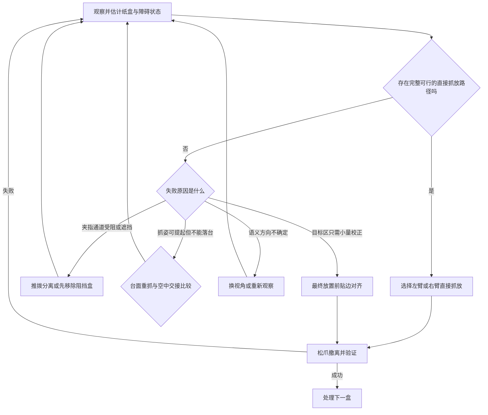

# 乱序纸盒定向整理与归位项目交接文档

更新日期：2026-10-05  
适用对象：项目组成员、后续接手本项目的新对话或新开发者  
课程任务：智能机器人设计课程项目制题目第六题

## 0 文档用途与当前结论

本文汇总目前已经讨论并实际验证的任务理解、技术路线、训练路线、仿真状态和下一步实验。阅读时必须区分三类信息：

- **已完成并有证据**：当前项目文件和输出报告能够支持的事实。
- **已经形成的设计结论**：团队当前采用的路线，但仍可能根据实验结果调整。
- **尚未实现或待教师确认**：不能在开题或答辩中表述为已经完成。

当前最重要的结论是：项目已经完成一个固定初始位置、直立纸盒、仿真真值驱动的单臂物理抓取—搬运—定向放置基线。下一步不需要重新搭建固定抓放，也不需要立刻训练策略；应先把现有控制器扩展为批量实验，改变纸盒初始位置和水平朝向，测出直接抓放的可行域和失败边界，再决定哪些失败确实需要重抓、环境接触或双臂协作。

本项目当前实际文件位于 `C:\Users\asus\Desktop\sim`。部分工具中仍保存了旧项目路径 `C:\Users\asus\Desktop\乱序整理与归位`，后续对话应以实际存在的 `sim` 目录为准。

## 1 课程任务与我们采用的任务定义

课程第六题要求在 Isaac Sim 或 Isaac Lab 中完成多个乱序小纸盒的识别、抓取、姿态调整和定向归位。初态可能包括平放但方向错误、侧放、倒置、互相遮挡或堆叠；系统需要判断哪些盒子可以直接抓取，哪些需要先整理，并体现双臂协同、失败检测和在线恢复。

我们当前采用以下边界：

| 项目 | 当前定义 |
|---|---|
| 机器人形态 | 两台固定安装的 Franka Panda 组成双臂工位 |
| 是否需要移动底盘 | 第一版不需要。当前任务集中在工位内的抓取、重定向和归位；除非教师明确要求导航，否则不增加移动底盘 |
| 纸盒模型 | 当前为 `100 × 55 × 45 mm`、`80 g` 的刚体盒；后续再做尺寸、质量、摩擦随机化 |
| 正向语义 | 盒体局部 `+Z` 表示指定顶面，局部 `+X` 表示指定前向；目标位姿也使用同样定义 |
| 归位含义 | 纸盒进入指定目标区域，顶面和前向正确，松爪、撤臂后持续稳定 |
| 感知 | 最终应由 RGB-D 估计对象位姿和场景关系；仿真真值只允许用于控制调试和评估打分 |
| 力与接触 | 第一版抓放不依赖力觉策略；后续在推拨、扶持、贴边或交接中再验证接触反馈的价值 |
| 训练 | 不是启动项。先建立可解释的脚本和规划基线，再只对明确的性能瓶颈引入学习 |

### 1.1 必须先冻结的方向定义

纯色长方体具有几何对称性，仅凭几何可能无法判断哪一面是顶面、哪一端是正向。因此最终场景需要不对称包装纹理、箭头、标签或多面颜色等语义证据。如果包装前后方向不同，则 yaw 相差 `180°` 也应判为不同方向。

当前代码把顶面胶带当作一条“轴”，在评价中把 `0°` 和 `180°` 视为等价。这适合无箭头胶带线，但不一定符合课程的“定向”语义。进入批量实验前必须向教师确认：

1. 课程只要求长轴对齐，允许 `180°` 对称；还是要求包装正面朝向唯一方向。
2. 是否允许我们给纸盒加入可观察的方向标记。

若要求唯一前向，应把当前轴向 yaw 误差改为有向 yaw 误差，并在盒体外观上加入可观测的 `+X` 标记。

## 2 已形成的任务完成思路

### 2.1 默认动作链

对于能够直接抓取的纸盒，默认路线是：

`观察 → 估计位姿 → 生成抓姿 → 验证完整路径 → 抓取 → 抬升 → 空中调整方向 → 接近目标 → 放置 → 松爪撤离 → 稳定性验证`

这里的“验证完整路径”不只检查抓取瞬间，还要检查预抓取、接近、闭合、抬升、空中转动、下放、松爪和撤离是否都可达且无碰撞。一个抓姿能把盒子夹起来，不代表它能以同一抓姿完成最终落台。

### 2.2 贴边对齐发生在什么时候

我们对“贴边对齐”的默认理解是：它主要发生在**最终放置前、纸盒仍被夹持时**。机械臂把纸盒降低到目标附近，利用挡边或目标区边缘约束少量位置和 yaw 误差，确认姿态稳定后再松爪。这是一种接触辅助的精放置动作。

抓取前通常不需要先把纸盒推到边缘。只有在以下情况下，抓取前整理才有意义：

- 邻近纸盒挡住了夹指的进场通道；
- 纸盒靠墙、夹爪无法从目标方向包络；
- 当前支撑姿态没有可完成后续放置的抓姿；
- 目标被遮挡或堆叠关系不清楚，需要先移开上层或障碍盒。

所以“先贴边再抓”是受条件触发的解锁技能，不是每次抓放的固定前置步骤。

### 2.3 何时使用第二只手

双臂的价值应由可达性、抓姿和接触限制触发，而不是因为场景里存在两台机器人就强制每次同时动作。第二只手主要有四类角色：

1. **任务分区**：根据左右工作空间选择更合适的抓取臂。
2. **扶持与限位**：稳定邻盒或目标盒，避免推拨时发生无关位移。
3. **交接**：当前抓姿能提起盒子但不能完成最终放置时，在共同工作区换到另一种抓持面。
4. **工作空间转移**：一只手能到达初始位置，另一只手更适合到达目标位置。

若另一只手可以从一开始直接完成整条路径，应直接分配给它，而不是为了展示协同而增加交接。对于当前小纸盒，两只夹爪同时靠近时容易互相遮挡，因此空中交接必须与“放到中间台面后重新抓取”做公平比较。

### 2.4 当前建议的决策流程

## 3 机器人和仿真平台选择

### 3.1 当前机器人选择

首选方案是两台固定安装的 Franka Panda：

- 每臂七自由度，有利于绕障、保持末端姿态和共同工作区操作；
- Isaac Sim 有官方 6.1 资产，当前项目已经实际加载并驱动；
- 两指夹爪每指行程约 `40 mm`，总开口约 `80 mm`，能够从纸盒 `55 mm` 或 `45 mm` 方向夹持；
- 当前固定工位已经形成可运行基线，继续使用比更换机器人更利于一周内完成开题和后续实验。

需要注意：开口足够不等于夹爪可以进场。沿 `55 mm` 方向夹持时，理想对中每侧开口余量只有约 `12.5 mm`，还需要容纳手指实体、碰撞裕量和位姿误差。沿 `100 mm` 长边跨盒夹持不在默认开口能力内。

OpenArm 和 ABB YuMi 可以在报告中作为候选对照，但在当前 Panda 基线已经跑通后，没有充分理由为开题阶段同时维护多套资产。

### 3.2 当前运行环境

当前实测环境为：

- Isaac Sim `6.1.0-rc.26+release.49347.2d230af4.gl`，安装于 `D:\isaacsim`；
- RTX 4060 Laptop，8 GB 显存，驱动 `617.14`；
- PhysX CPU 刚体仿真 `120 Hz`，每 4 个物理步渲染一次；
- 两台官方 Franka Panda 6.1 USD，每台 articulation 为 9 DOF；
- 项目自带 `sorting.kit` 加载必要扩展。

之前“Isaac Sim 尚未安装”的记录已经过时。租赁服务器仍可用于批量实验、并行环境和后续训练，但不再是建立第一个可运行场景的前提。租用服务器时仍应确认 RTX GPU、RT Core、显存、驱动、图形支持和磁盘持久化，并尽量与本机使用同一 Isaac Sim 版本。

## 4 当前仿真已经完成到哪里

### 4.1 能力清单

| 能力 | 状态 | 说明 |
|---|---|---|
| 双 Panda 固定工位、桌面、卸料盘、目标区和输送带 | 已完成并运行 | 目标格位使用无可见几何的逻辑 Xform |
| 9 个纸盒随机释放与物理沉降 | 已验证一个固定种子 | seed 6 已通过沉降判据；不是自动整理 |
| 双路 RGB-D 与实例分割记录 | 已完成 | 顶视和斜视相机可保存 RGB、深度、实例标签和标定数据 |
| 固定单盒物理抓放 | 已完成并通过一次完整验证 | 左臂执行，右臂保持 home；使用真值与 Lula IK |
| 三格输送带物理出站 | 已验证 | 三格全部满足条件后，表面速度通过摩擦驱动纸盒 |
| 初始位置和 yaw 批量泛化 | 未完成 | 当前只有一个固定单盒成功案例 |
| 侧放、倒置与完整三维重定向 | 未完成 | 当前单盒控制器只接受近似直立纸盒 |
| RGB-D 位姿估计闭环 | 未完成 | 相机目前用于记录，控制器读取仿真真值 |
| 通用避碰和抓姿规划 | 未完成 | 当前为针对固定工位的笛卡尔路径与 IK 检查 |
| 双臂扶持、重抓或交接 | 未完成 | 第二臂仅保持 home |
| 3 盒或 9 盒自动整理 | 未完成 | 已有乱序场景，没有自动任务执行器 |
| 强化学习、模仿学习或 VLA 策略 | 未开始 | 现阶段不需要 |

### 4.2 固定单盒基线的实际内容

当前 `workstation/single_pick_place.py` 已实现完整状态机：

`PREGRASP → APPROACH → CLOSE → LIFT → TRANSFER → LOWER → OPEN → RETREAT → HOME → VERIFY → DONE`

控制链路为：

`仿真真值位姿 → Lula IK → 物理关节位置驱动 → 指爪真实接触 → 放置后闭环评价`

该实现没有把纸盒绑定到夹爪，也没有通过改写盒子位姿制造抓放结果。移动前会预求解路径上的 IK 节点，遇到不可达或关节跳变会在执行前失败；搬运阶段还会检查盒子相对 TCP 的距离，识别滑脱。它仍不是带场景碰撞搜索的通用运动规划器。

当前固定案例参数：

| 参数 | 数值 |
|---|---|
| 执行臂 | `panda_left` |
| 初始中心位置 | `[-0.20, -0.06] m` |
| 初始姿态 | 顶面朝上，yaw `20°` |
| 目标 | slot 0，中心约 `[-0.20, -0.40] m` |
| 抬升高度 | `0.18 m` |
| 目标 yaw | `0°` |
| 纸盒 | `100 × 55 × 45 mm`，`80 g` |

历史固定单盒物理验证（原始输出已清理）的主要结果：

| 指标 | 实测结果 |
|---|---|
| 任务状态 | `success: true`，进程退出码 0 |
| 实际抬升 | `0.179945 m` |
| 最终 XY 误差 | `0.002743 m` |
| 最终轴向 yaw 误差 | `0.26355°` |
| 最终线速度 | `0.001602 m/s` |
| 最终角速度 | `0.000029 rad/s` |
| 稳定保持 | `0.5 s` |
| 机械臂状态 | 两臂回到 home，夹爪已张开 |
| 仿真时间 | `47.39 s` |
| 该次实际进程时间 | 约 `316.74 s`，包含启动、渲染和保存 |

### 4.3 当前实现的关键限制

1. 单盒初始位置和 yaw 虽然已经写入配置，但每次 `single_pick_place` 运行会使用固定配置；只改 `--seed` 不会随机化该案例。
2. 控制器在构造时从沉降后的仿真真值读取纸盒位置和 yaw；RGB-D 图像不参与控制。
3. 当前单盒逻辑在纸盒倾角超过约 `5°` 时直接拒绝，因此不能处理侧放或倒置。
4. 当前末端姿态为从上向下抓取，只调整水平 yaw；没有多面抓姿生成器。
5. 当前评价把胶带方向视为 `180°` 对称轴，尚未验证唯一前向语义。
6. 当前只有一次固定案例成功，不能据此声称具有随机场景成功率。

## 5 推荐的系统分解

完整任务不应直接压成一个端到端网络。更稳妥的结构是一个分层闭环系统：

| 层级 | 输入 | 输出 | 第一版实现 |
|---|---|---|---|
| 感知层 | RGB-D、相机标定 | 盒子 6D 位姿、方向置信度、可见性 | 先用真值隔离控制问题，随后接入视觉估计 |
| 场景理解层 | 对象位姿与接触关系 | 支撑图、遮挡关系、待处理顺序 | 规则与几何判断 |
| 候选生成层 | 当前盒子、目标和机器人状态 | 抓姿、放姿、左右臂、推拨或重抓候选 | 几何模板、IK 与碰撞检查 |
| 高层策略 | 候选质量、风险、历史失败 | 选择技能和候选参数 | 先使用可解释规则，后续可学习 |
| 低层技能 | 技能目标、机器人与接触状态 | 关节或末端命令 | 脚本状态机、IK、闭环接触控制 |
| 执行监测 | 位姿、速度、夹爪和接触信号 | 成功、失败类型、恢复请求 | 阈值和状态机 |

低层技能库按需求逐步增加：

1. 直接抓取与定向放置；
2. 推拨分离；
3. 中间台面放置后重抓；
4. 最终放置前贴边对齐；
5. 另一只手扶持或限位；
6. 空中交接；
7. 重新观察与失败恢复。

所谓“放进一个策略”更适合理解为：一个高层策略根据观测选择技能和参数，技能内部继续使用可验证的控制器。这样可以知道失败来自感知、决策还是执行，也更适合课程答辩和消融实验。

## 6 从当前基线到完整任务的收敛路线

| 阶段 | 要回答的问题 | 是否需要训练 | 通过证据 |
|---|---|---|---|
| P0 固定单盒基线 | 物理抓取、搬运、定向放置链路是否成立 | 否 | 已完成一次完整成功运行 |
| P1 直接抓放可行域 | 改变初始位置和 yaw 后，现有链路在哪些区域稳定成功 | 否 | 批量统计成功率、失败阶段和可行域图 |
| P2 多抓姿与姿态恢复 | 侧放、倒置是否可直接抓、台面重抓或借助环境恢复 | 否，先做规划和脚本 | 每类姿态存在可复现的完整动作链 |
| P3 双臂作用验证 | 第二臂在哪些几何条件下提高覆盖范围或可靠性 | 否，先做确定性技能 | 与单臂重抓基线的公平对照 |
| P4 视觉闭环 | 用 RGB-D 估计替代控制器真值后性能下降多少 | 可训练感知模型 | 位姿误差和闭环任务成功率同时报告 |
| P5 多盒任务 | 遮挡、堆叠、顺序和失败恢复能否闭环完成 | 高层先用规则 | 3 盒再到 9 盒的固定测试集结果 |
| P6 学习型决策 | 学习是否比规则更会选择直接抓、推拨、重抓、交接或重观察 | 可选，需有基线和数据后再做 | 同任务集上的成功率、时间、动作次数和泛化对照 |

路线中的基本原则是：每次只增加一种困难。如果在随机位置和 yaw 上都没有稳定的直接抓放基线，侧放、双臂、视觉误差和强化学习同时加入后将无法判断失败原因。

## 7 下一步实验 直接抓放可行域

这是当前最应该执行的实验，不需要先训练策略。

### 7.1 实验目标

复用现有 `single_pick_place.py`，系统改变直立纸盒的初始 `(x, y, yaw)`，回答：

- 哪些位置和朝向可由左臂完成整条抓放路径；
- 失败发生在预抓取、接近、夹持、抬升、转移、下放还是验证阶段；
- 失败来自 IK、轨迹跳变、滑脱、落位误差还是超时；
- 直接抓放的边界是否足以覆盖入料区，哪里需要另一只手或其他技能。

### 7.2 最小代码改动

当前控制器本身不需要重写。新增一个外围批量评估器即可：

1. 为每个实验案例生成独立的 `box_xy`、`box_yaw_deg`、`slot_index` 和 `arm` 配置；
2. 每个案例使用唯一输出目录，保留 `config_used.json`、`task_report.json` 和失败信息；
3. 汇总为一份 CSV 或 JSON，包含参数、成功与否、最后阶段、失败原因、时间和最终误差；
4. 可先关闭传感器保存或只为失败案例保存图像，降低每次运行耗时；
5. 不把 `--seed` 当成单盒位置随机化，因为当前单盒分支会覆盖随机释放状态。

### 7.3 建议实验矩阵

先运行 15 个小规模案例，确认批处理和指标正确：

- `x ∈ {-0.26, -0.20, -0.14} m`；
- `y = -0.06 m`；
- `yaw ∈ {-60°, -30°, 0°, 30°, 60°}`；
- 固定左臂和 slot 0。

通过后扩展为 45 个案例：

- `x ∈ {-0.26, -0.20, -0.14} m`；
- `y ∈ {-0.10, -0.06, -0.02} m`；
- `yaw ∈ {-60°, -30°, 0°, 30°, 60°}`。

这些数值是围绕当前成功点的首轮扰动，不是最终工作空间边界。若首轮大量失败，应缩小范围并定位原因；若全部成功，再向卸料区边界扩展。由于当前一次完整运行实际约需 5 分钟，45 个案例串行约需数小时，适合在批处理稳定后使用无窗口模式或服务器运行。

### 7.4 每例必须记录的指标

| 指标组 | 内容 |
|---|---|
| 输入 | 初始 `(x, y, yaw)`、目标格、执行臂、配置版本 |
| 规划 | 各阶段 IK 是否可解、最大关节跳变、失败前阶段 |
| 抓取 | 是否成功抬升、最大抬升量、盒子与 TCP 距离、指爪位置 |
| 搬运 | 是否滑脱、完成时间、可选的路径长度和最小碰撞间隙 |
| 放置 | XY、Z、倾角、有向或轴向 yaw 误差 |
| 稳定性 | 线速度、角速度、稳定保持时间、是否完成撤臂 |
| 结果 | 成功或失败、标准化失败类型、日志路径 |

实验结果应形成位置—朝向成功率图和失败类型统计。这个可行域将决定下一阶段优先做“更多抓姿”“另一只手”“台面重抓”还是“运动规划”。

## 8 侧放 倒置 重抓与交接路线

P1 稳定后再加入完整三维初态。侧放或倒置不能继续只用 yaw 描述，应使用完整四元数并建立多面抓姿生成器。

建议按以下顺序处理：

1. **侧放且周围空旷**：验证从 `45 mm` 或 `55 mm` 方向夹持后能否空中转正并落台。
2. **倒置且周围空旷**：验证当前抓姿翻正后，手掌是否挡住最终落台。
3. **台面重抓**：将盒子先放到稳定中间姿态，松手后从另一组面重新抓取。
4. **空中交接**：只有当台面重抓过慢、无可用中间区或不能跨越工作空间时才加入。
5. **狭窄或遮挡场景**：加入推拨分离或另一臂扶持。

台面重抓与空中交接必须在相同初态、目标、时间预算和失败判据下比较。不能只把“双臂完整系统”与“单臂一次直接抓取”对照；单臂基线也应允许推拨和台面重抓。

空中交接的成功判定应至少包含：接收臂建立稳定夹持、发送臂松开、接收臂做小幅验证运动后纸盒不滑脱。不能用固定约束或瞬间绑定纸盒代替两夹爪的真实接触交接。

## 9 训练路线与算法选择

### 9.1 为什么当前不应先训练

现阶段只有一个固定案例成功，任务分布、动作空间和失败类型都没有冻结。直接训练会把场景参数、控制器缺陷和策略学习混在一起，既难收敛，也无法解释策略学到了什么。当前 P1 和 P2 都能通过脚本、IK 和候选搜索获得更清晰的可行性证据。

训练应满足以下前置条件：

- 目标位姿与成功判据已经冻结；
- 每种低层技能有可重复的成功和失败反馈；
- 已有固定训练集与独立测试集；
- 规则或搜索基线已经跑出可比较的结果；
- 能明确说出要优化的是感知、技能选择、接触控制还是端到端执行。

### 9.2 推荐的学习架构

优先选择“脚本低层技能 + 学习型高层选择器”的分层策略，而不是直接让单个网络输出两台机械臂所有关节命令。

高层策略的观测可以包括：

- 目标盒和目标格的相对位姿；
- 顶面与前向置信度；
- 左右臂的 IK 可达性和碰撞裕量；
- 候选抓姿评分；
- 遮挡、支撑与邻盒间隙；
- 上一步技能、失败类型和重试次数。

动作可以定义为：

- 技能编号：左/右臂直接抓放、推拨、台面重抓、双臂扶持、交接、贴边精放置、重新观察；
- 候选编号：选择哪个盒子、抓姿、推拨方向或中间位姿；
- 小范围连续残差：对候选位姿做有限修正。

低层仍由 IK、状态机和接触监测执行。高层每个技能结束后重新观察并再决策，天然形成闭环。

### 9.3 推荐算法顺序

| 阶段 | 算法 | 用途与理由 |
|---|---|---|
| 基线 | 规则、候选搜索和有限状态机 | 可解释，能生成成功轨迹和失败标签 |
| 初始学习 | 行为克隆 BC | 从搜索或人工规则的轨迹学习技能选择，训练稳定、容易验证 |
| 分布修正 | DAgger 或失败样本再标注 | 让策略覆盖自己访问到的偏离状态，减少纯 BC 累积误差 |
| 性能微调 | 带无效动作屏蔽的 PPO | 在已有技能库上优化成功率、时间和动作次数；适合离散技能加少量连续参数 |
| 接触技能 | 单技能 PPO，必要时加入课程学习和域随机化 | 只在推拨、扶正或贴边等接触动作确实难以脚本化时使用 |
| 拓展研究 | ACT、扩散策略或 VLA | 只有在数据量、视觉闭环和基线足够时作为拓展，不作为当前主线 |

最推荐的训练主线是：**规则或搜索生成示范 → BC 预训练高层技能选择器 → DAgger 补充失败附近样本 → PPO 在仿真中微调**。如果后续实验表明规则已经足够完成课程要求，学习可以缩小为一个研究对照，而不必强行成为主控制器。

### 9.4 PPO 的奖励与课程设计

若进入 PPO 阶段，奖励应围绕最终任务和动作代价设计，而不是只奖励末端靠近物体：

- 成功完成一个盒子：较大的正奖励；
- 正确顶面、前向和目标格：分项奖励；
- 掉落、碰撞、越界、错误抽取下层盒：较大惩罚；
- 每次推拨、重抓、交接和重新观察：小的动作成本；
- 时间步和总路径：小的效率成本；
- 无进展或重复同一失败动作：惩罚并终止或触发恢复。

课程顺序建议为：固定单盒 → 随机位置和 yaw → 侧放/倒置 → 单一障碍 → 三盒遮挡 → 九盒乱序。视觉噪声、摩擦、质量和尺寸随机化应逐步加入，不能从第一轮同时全开。

## 10 双臂价值的实验对照

为了说明双臂究竟带来什么，至少保留以下四组：

| 组别 | 能力 |
|---|---|
| A | 单臂直接抓取、调整和放置 |
| B | 单臂直接抓放 + 必要推拨 + 台面重抓 |
| C | 双臂按工作空间分工，但不做空中交接 |
| D | 双臂选择性扶持、协同推拨或交接 |

关键对照是 B 与 D，因为它能区分“双臂协作”相对于“已经允许恢复的强单臂基线”的真实贡献。

结果应分成两个任务集报告：

- **双方都可达的共同任务集**：比较成功率、总时间、重抓次数、无关盒位移和失败恢复，衡量协同带来的效率与鲁棒性。
- **只有双臂工作空间并集能够覆盖的任务集**：衡量双臂带来的覆盖范围，不能混入共同任务集后笼统声称算法全面更优。

最适合开题后首先验证的双臂案例是：同一个抓姿受限但仍可先提起的盒子，比较“台面重抓后定向放置”和“空中交接后定向放置”。如果小盒尺寸导致两只 Panda 夹爪无法同时接近，则把协同重点转向“一臂稳定邻盒，另一臂推拨分离”。

## 11 建议的创新点

当前最适合的创新方向是：**根据抓取可行性、姿态不确定性和动作风险，选择性启用第二只手与环境接触。**

它不是把双臂动作固定写进每个案例，而是让系统判断：

- 简单场景是否应直接完成；
- 何时需要推开遮挡；
- 何时台面重抓比空中交接更安全；
- 何时另一臂扶持能够减少无关盒位移；
- 何时方向不确定，应先重新观察；
- 何时最终误差适合用低速贴边修正。

可以形成三个可验证的研究问题：

1. 风险触发的技能选择是否能在不降低成功率的情况下减少不必要的双臂步骤？
2. 在什么抓姿和工作空间条件下，空中交接优于台面重抓？
3. 接触或力反馈是否能提高摩擦变化下推拨和贴边动作的稳定性？

环境接触辅助操作和双臂协作本身已有研究，报告中不应把概念本身声称为原创。创新应落在本任务中的触发条件、分层策略、失败恢复和有对照的实验结论上。

## 12 统一评价指标

| 类别 | 指标 |
|---|---|
| 最终结果 | 单盒成功率、整场成功率、错误目标格数量 |
| 位姿精度 | XY、Z、倾角、完整旋转或有向 yaw 误差 |
| 稳定性 | 松爪撤臂后的线速度、角速度和连续保持时间 |
| 效率 | 总时间、路径长度、技能次数、重抓次数、交接次数 |
| 安全与扰动 | 掉落、碰撞、越界、最大接触力、无关盒位移 |
| 恢复能力 | 首次成功率、恢复后成功率、平均重试次数、失败类型 |
| 感知 | 位置误差、姿态误差、方向分类正确率、置信度校准 |
| 双臂贡献 | 共同任务集收益和额外覆盖任务集分别报告 |

当前代码阈值是工程起点：XY `18 mm`、Z `8 mm`、倾角 `8°`、轴向 yaw `8°`、线速度 `0.015 m/s`、角速度 `0.15 rad/s`、稳定保持 `0.5 s`。早期方案中提出过更严格的 `10 mm / 5°` 目标，但尚未在当前工位冻结。开题材料应明确“当前实现阈值”和“期望研究目标”的区别。

## 13 开题报告前的一周如何使用现有成果

开题阶段不需要声称完整任务已经完成。更可信的叙述是：已经用真实物理接触跑通最小执行链，并根据这个基线设计后续可行域、双臂协同、视觉闭环和学习实验。

建议开题内容按以下顺序组织：

1. 课程问题、纸盒方向语义和成功判据；
2. 双 Panda 固定工位的选型依据；
3. 已完成场景、九盒沉降、RGB-D 输出、输送带和固定单盒抓放证据；
4. 固定案例的定量结果与当前限制；
5. 从直接抓放可行域到侧放/倒置、双臂、视觉和多盒的阶段路线；
6. 分层策略和未来训练路线；
7. 选择性双臂协作的创新假设及四组对照；
8. 风险、待确认事项和人员分工。

开题中可以表述“已完成”的内容：

- Isaac Sim 6.1 双 Panda 工位已运行；
- 9 盒随机释放和物理沉降已验证一个种子；
- 双路 RGB-D、深度、实例标签和标定可输出；
- 三格输送带物理运动已验证；
- 一个固定直立单盒由左臂通过真实接触抓取、抬升、调整 yaw、放置、撤离并验收成功。

开题中不能表述为已完成的内容：

- 随机位置和朝向的成功率；
- RGB-D 驱动的抓取控制；
- 侧放、倒置和完整三维姿态恢复；
- 双臂扶持或交接；
- 九盒自动整理；
- 任何学习策略优于基线的结论。

## 14 小组工作线建议

| 工作线 | 近期任务 | 接口产物 |
|---|---|---|
| 仿真与控制 | 批量直接抓放、姿态初态生成、多抓姿和技能控制器 | 每次运行配置、轨迹、任务报告 |
| 感知 | 方向标记设计、RGB-D 位姿估计、遮挡与置信度 | 对象位姿、方向、置信度和可见性 |
| 规划与学习 | 候选生成、可达性评价、技能选择、后续 BC/PPO | 候选列表、技能编号和参数 |
| 评估与报告 | 固定测试集、指标统计、失败分类、开题和答辩材料 | 汇总表、图、视频索引和结论边界 |

接口应尽早统一：对象位姿使用世界坐标和 `wxyz` 四元数；每个对象都带时间戳、置信度和语义方向；每次动作返回标准化成功状态和失败类型。

## 15 尚待确认和冻结的事项

1. 教师是否要求移动底盘，还是固定双臂工位即可。
2. “定向”是否区分 `0°` 与 `180°`，以及是否允许人工方向标记。
3. 视觉和腕部六维力/力矩传感器的最终验收口径。
4. 最终对象数量、纸盒尺寸范围、目标区域尺寸和时间限制。
5. 课程是否硬性要求训练，还是规则、规划与学习对照均可。
6. 最终成功阈值采用当前实现值，还是收紧到 `10 mm / 5°`。
7. 服务器是否用于批量实验和 Isaac Lab 训练；若使用，需要冻结镜像、GPU 和驱动。

这些问题不会阻止 P1 批量可行域实验，但会影响后续感知标记、评价函数和训练任务定义。

## 16 文件和证据索引

| 路径 | 作用 |
|---|---|
| `README.md` | 项目入口和当前简要状态 |
| `任务理解与首轮方案.md` | 前期任务调研、选型和场景设计；其中“未安装”等部分已过时 |
| `workstation/README.md` | 当前工作站运行方式、场景和输出说明 |
| `workstation/VALIDATION.md` | 实际运行条件、通过项、已修复问题和未验证范围 |
| `workstation/config.json` | 纸盒、机器人、目标、相机、阈值和固定单盒参数 |
| `workstation/environment.py` | 场景、物理步进、真值观测、关节命令和传感器 |
| `workstation/single_pick_place.py` | 固定单盒的 IK、物理抓放状态机和执行监测 |
| `workstation/task_logic.py` | 配置校验、姿态与落位评价、输送和任务逻辑 |
| `workstation/test_task_logic.py` | 纯逻辑测试，不能代替 Isaac Sim 物理验证 |
| `原始 task_report.json（已清理）` | 当前固定单盒成功的核心定量证据 |
| `原始 control_trace.jsonl（已清理）` | 固定单盒的阶段、TCP、关节和盒子轨迹 |

## 17 后续新对话的推荐开场提示

新对话开始时，可以直接提供本文件并使用下面这段话：

> 请先阅读《项目路线与当前状态交接.md》以及其中列出的 README、VALIDATION 和成功运行报告。当前固定位置、直立单盒的真值 IK 物理抓放已经完成，请不要从重建该基线或立即训练策略开始。先核实代码现状，然后从 P1 直接抓放可行域继续：设计并实现外围批量评估器，改变单盒初始 x、y、yaw，保持每例独立输出并汇总失败阶段。任何新增结论都要区分已实测、代码可支持和仅计划三种状态。

## 18 当前最近一步

下一项具体工作已经收敛为：

1. 先确认方向评价采用轴向 yaw 还是有向 yaw；
2. 在不改写现有抓放控制器的前提下新增批量评估器；
3. 运行 15 例小矩阵，检查输出和失败分类；
4. 扩展到 45 例位置—yaw 网格，绘制直接抓放可行域；
5. 根据真实失败分布决定 P2 优先开发多抓姿、台面重抓、另一只手还是通用避碰。

在这一步完成前，不启动 PPO、VLA 或端到端视觉动作训练。
